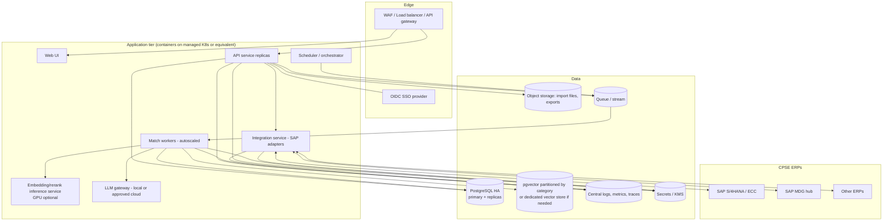
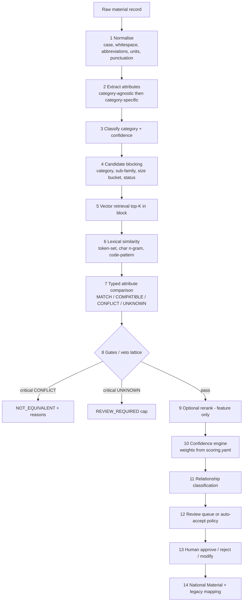
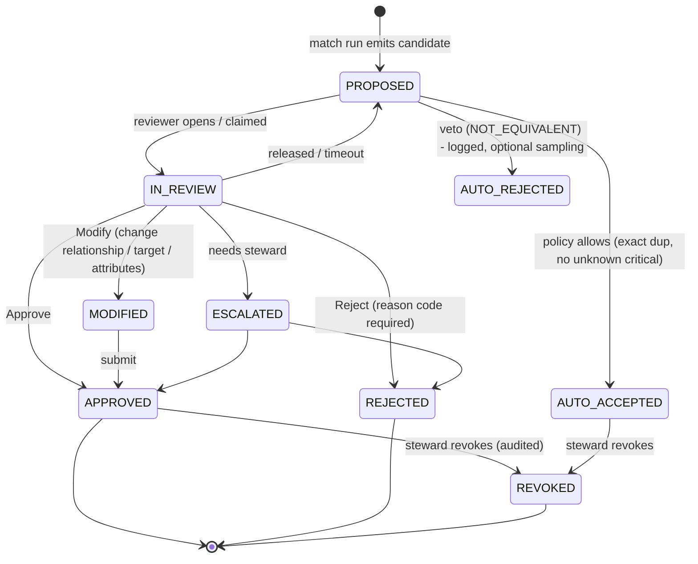
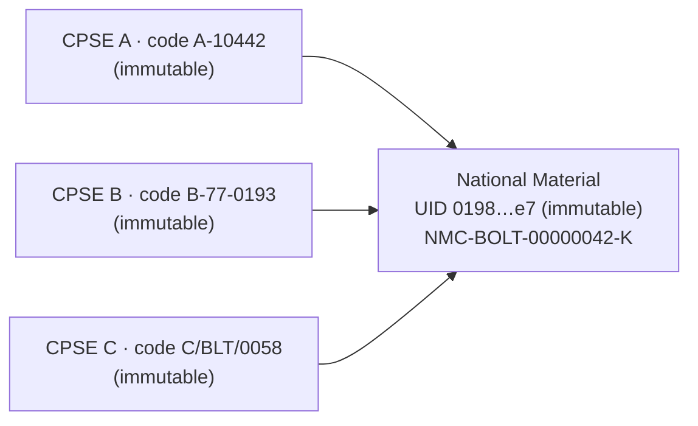
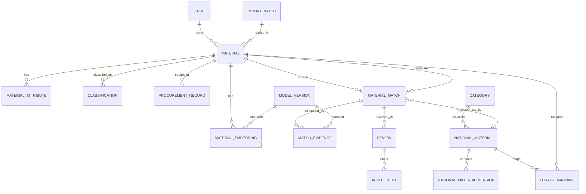
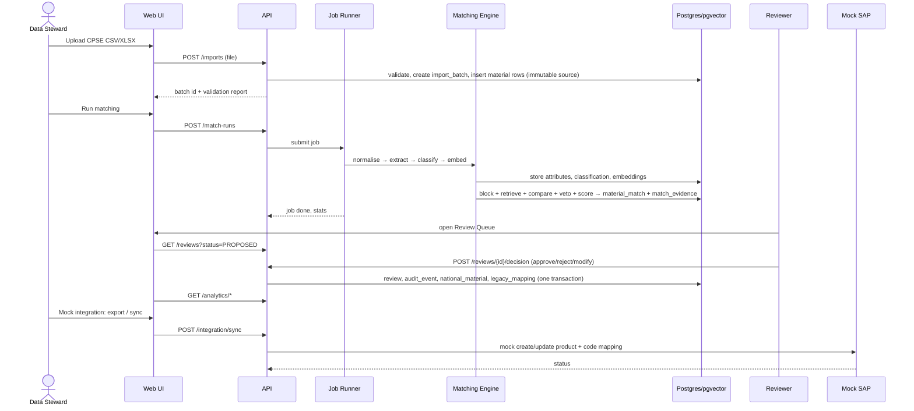
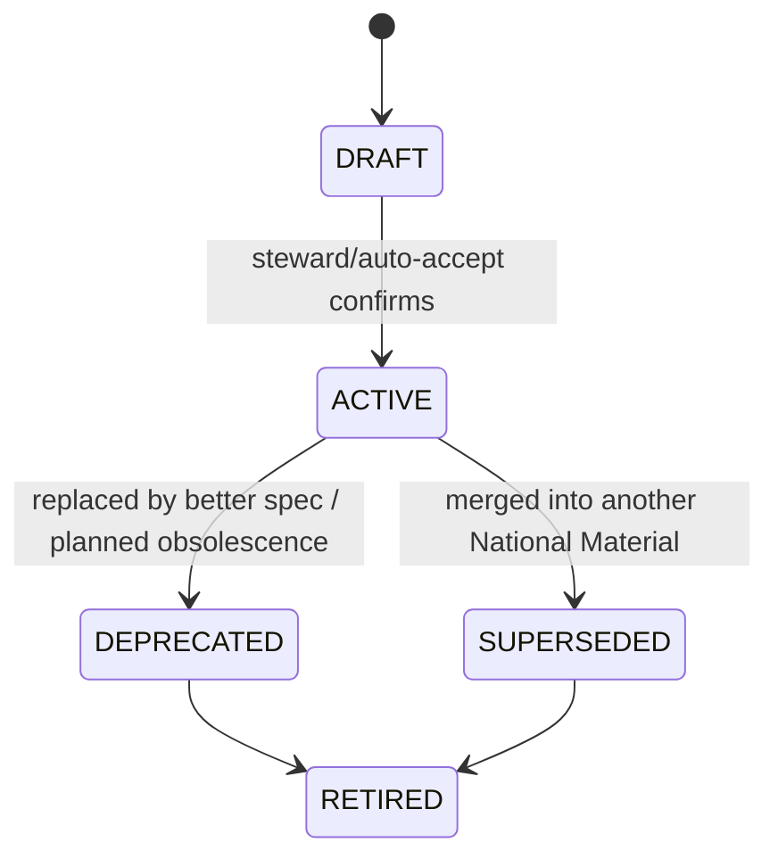

# ARCHITECT.md — National Unified Material Master Framework (SIH 2026 · PS 26099)

**Problem statement:** AI-Driven Standardization and Harmonization of Material Codes Across CPSEs
**Audience:** Google Antigravity (autonomous coding agent) + the human owner
**Status:** Architectural source of truth. If code and this file disagree, this file wins unless `docs/DEVIATIONS.md` records why.
**Companion:** `VERSION.md` (models, providers, versioning, env vars)
**Priority legend:** **P0** = must work in today's sprint · **P1** = if time remains · **P2** = production/future

---

## 1. Executive Summary

We build a **governed entity-resolution platform for engineering materials**, not a "CSV → embedding → cosine → dashboard" demo.

Core idea in one paragraph: each CPSE's material record is normalised, parsed into **category-specific structured attributes**, and compared pairwise (after blocking) through a **typed attribute comparison** that yields per-attribute verdicts `MATCH / COMPATIBLE / CONFLICT / UNKNOWN`. Embeddings and fuzzy text only *find candidates* and add *supporting evidence*. A **veto lattice** lets any critical `CONFLICT` force `NOT_EQUIVALENT` and any critical `UNKNOWN` force `REVIEW_REQUIRED`, regardless of semantic score. Survivors get an **explainable confidence** from a versioned, externally configurable scoring file. Humans approve/reject/modify in a review queue; every decision is hash-chained in an audit log and stored as labelled training/eval data. Approved links create or extend a **National Material** whose immutable internal ID is separate from its human-readable **National Material Code (NMC)**. Original CPSE codes are never modified; they hang off the National Material through time-bounded **legacy mappings**.

P0 delivers one complete vertical slice: upload → validate → normalise → extract → classify → block → match → compare → veto → score → review → national ID + legacy mapping → analytics → mock-SAP export/sync, running from `docker compose up` on a laptop.

---

## 2. PS Interpretation

| PS capability | Our interpretation | Where handled | Priority |
|---|---|---|---|
| AI-based material matching | Multi-signal pairwise matching with veto + score | §16–22 | P0 |
| Duplicate / near-duplicate detection | Relationship types `EXACT_DUPLICATE`, `NEAR_DUPLICATE`, including intra-CPSE duplicates | §22, §27 | P0 |
| Functionally equivalent detection | Critical attrs match/compatible via standard-equivalence + UOM conversion; always human-reviewed | §19–22 | P0 |
| Description standardisation | Deterministic canonical description built from attributes (SAP-length variants) | §13, §30 | P0 |
| Technical attribute extraction | Regex + dictionaries + unit registry per category pack; optional LLM assist | §14 | P0 |
| Material classification | Rule + TF-IDF/LogReg classifier → category id with confidence | §15 | P0 |
| Common National Material Code | Deterministic NMC with check character; separate immutable UID | §24 | P0 |
| Legacy CPSE code mapping | Time-bounded `legacy_mapping`; sources immutable | §25 | P0 |
| Migration support | Import batches, dry-run, mapping export, cut-over report | §12, §30 | P0 (export) / P1 (dry-run diff) |
| Human validation & approval | Review queue state machine + RBAC | §23, §32 | P0 |
| Material analytics | SQL-derived metrics, no hard-coded numbers | §26, §29 | P0 |
| Audit trail | Append-only hash-chained `audit_event` | §33 | P0 |
| Governance | Roles, config versioning, revalidation flags, deprecation lifecycle | §24, §32–33 | P0/P1 |
| SAP/ERP integration capability | Mock adapter now; honest S/4HANA design for production | §30 | P0 mock / P2 real |
| Traceability NMC → original codes | Query + UI "Legacy Mapping" screen | §25 | P0 |

---

## 3. Goals

1. A working, demonstrable vertical slice by end of day, started from `docker compose up`.
2. Visible proof that **semantic similarity alone cannot create equivalence** (the "8.8 vs 10.9" demo is a first-class UI moment and automated test).
3. Real human-in-the-loop with persisted, reusable labels.
4. Honest explainability: every verdict can be reproduced from stored evidence + config versions.
5. Replaceable AI providers, offline-capable.
6. Clean separation of *implemented in prototype* vs *production design*.

## 4. Non-Goals (for today)

- Real SAP/ERP connectivity, real SSO, HA, Kubernetes, Kafka, Airflow, distributed vector DB.
- Training large models. (Small scikit-learn models only; P1.)
- Handling every material category. (6 categories in P0; the framework makes adding more a config task.)
- OCR of invoices/PDFs, image-based matching.
- Claiming accuracy on real CPSE data. We report metrics **only** on our labelled synthetic + reviewer-adjudicated sets and label them as such.
- Price optimisation or contract negotiation features.

## 5. Design Principles

1. **Evidence over embeddings.** Structured evidence decides; embeddings propose.
2. **Veto beats score.** Critical conflict ⇒ not equivalent. Critical unknown ⇒ review.
3. **Unknown is not a match.** Missing data is a distinct state, never "probably same".
4. **Identity ≠ description.** Immutable UID is separate from NMC; NMC is separate from attribute text.
5. **Sources are sacred.** CPSE codes and raw text are write-once.
6. **Config is data, versioned and hashed.** Category packs, abbreviations, thresholds live in files, hashed into `model_version`.
7. **Every machine output is attributable** (model, version, input hash, time, evidence).
8. **Humans own consequences.** High-impact or uncertain ⇒ human approval.
9. **Fail soft, record loudly.** Provider failure → fallback + `degraded` flag, never silent.
10. **Boring infrastructure.** One backend service, one DB, one frontend. No microservices.
11. **Truthful metrics.** Dashboards are SQL over real tables. Synthetic data is labelled as synthetic.

---

## 6. Competitive Analysis (public SIH 26099 repositories)

*Method: inspected the public README/landing pages of the five repositories you listed (fetched 2 Oct 2026). This is **not** a code audit; claims below are what each repo documents about itself. Metrics quoted by repos are self-reported on their own synthetic data and are not comparable to ours.*

| Repo | Architecture & stack | Matching / AI approach | UI & governance | Integration | Strengths | Limitations (as documented) |
|---|---|---|---|---|---|---|
| **Varunsai1930/SIH** | Python, Streamlit, CSV outputs, no DB; `normalize.py → match.py → standardize.py` | Regex-extracted ~35 attributes; MiniLM embeddings with TF-IDF fallback; category blocking; **hard-attribute veto**; "missing identity attribute ⇒ never auto-merge" rule | 4-tab Streamlit (overview, review, lookup, audit); approvals persisted to CSV; live CSV upload | none (CSV only) | Veto + missing-attribute safety; deterministic, labelled-benchmark metrics; offline fallback | No DB/API/RBAC; single user; NMC is a hash of canonical attributes (identity changes if attributes change); review/audit in flat files |
| **jaimin2904/AI-powered_MaterialMaster…** | React/Vite, FastAPI, SQLAlchemy, SQLite; MiniLM + cosine | Normalise → extract → embed → recommend | Review (approve/reject), audit history, dashboard | none | Simple and readable | Documented approach is embedding similarity; no documented conflict veto, category schemas, or integration seam |
| **coderaarav12/SIH2026 (SyncMasters)** | React/Vite/Tailwind, Cloudflare Workers + Hono + D1 (SQLite), separate Python FastAPI "AI swarm" with Ollama (Llama 3.2 text + vision) | **LLM-centric**: agents for cleaning, OCR of POs/invoices, semantic matching with confidence | RBAC demo accounts, savings dashboard, PDF compliance report | Split edge/local-AI deployment | Invoice/PO OCR idea; data-sovereignty pitch (local LLM); polished dashboard | LLM as matcher is hard to audit/reproduce; no documented deterministic conflict gate; 3-process deployment; documented shared demo password |
| **Procoder1234556/national-unified-material-master (NUMM)** | React/Vite, FastAPI, SQLite default; prod compose with Postgres/pgvector + Redis + Nginx; many planning docs | Offline deterministic embedding projection by default (BGE optional) + RapidFuzz; **ASME/API safety gate** | Steward review, Search-Before-Buy, surplus transfer, pooled demand, **SHA-256 audit chain**, five personas | Simulated MeghRaj SSO/SAP/GeM seams, clearly labelled | Strongest governance and "beyond matching" scope; honest sim-vs-live labelling; crosswalk fields (MESC/UNSPSC/GeM) | Default semantic signal is not a real language model; very broad scope; safety gate is standards-centric rather than a category-extensible attribute framework |
| **kousikan17/material-harmonization** | React+TS+Vite+Tailwind+Radix; FastAPI, SQLAlchemy 2, Postgres+pgvector, Alembic, Celery+Redis; connectors for Postgres/MySQL/Oracle/SQL Server | SBERT → pgvector retrieval → **11-component weighted score** → regex conflict detector → optional XGBoost → decision engine (IDENTICAL/DUPLICATE/NEAR/FUNCTIONAL/NOT_EQUIVALENT/TECHNICAL_CONFLICT/MANUAL_REVIEW) | JWT RBAC (4 roles), company data isolation, approvals incl. edit-and-approve, audit with before/after + model version, 122 tests | DB connectors; no SAP | Most complete engineering; idempotent mappings; approved mappings protected; connector-first ingestion | Conflict vocabulary is global regex (grade/dimension/thread/voltage/pressure), not category-defined; plain sequence code `CM-XXXXXX`; heavy infra for a 1-day build; no shipped trained ranker |

**Becoming common (do not treat as differentiators):** MiniLM + cosine; category blocking; some form of grade/size veto; review queue with approve/reject; audit log; RBAC; synthetic data; savings dashboard.

### What we do differently (and why it is defensible)

1. **Category packs as data.** Each category declares attributes, types, comparators, criticality tiers, allowed values, unit dimension, and required-for-identity flags in YAML. New categories need no engine changes. (Others use global regex vocabularies or hard-coded tables.)
2. **Four-state attribute verdicts with explicit `UNKNOWN`.** Missing ≠ match. Critical `UNKNOWN` caps the result at `REVIEW_REQUIRED`.
3. **Pair Evidence Ledger.** Each pair stores per-signal evidence, gate outcomes, config hashes and model fingerprints, so any verdict is replayable.
4. **Veto lattice before scoring.** The score never gets a chance to "average away" a conflict.
5. **Identity/code separation with a spec-fingerprint guard.** Immutable UID + check-digit NMC; a unique *active* `(category, spec_fingerprint)` constraint blocks accidental creation of two National Materials with identical critical specs (it forces a merge proposal instead).
6. **Live trap suite and eval in the UI.** A "Model Assurance" panel runs the adversarial pairs (high semantic similarity + conflict) and shows precision/recall/F1/FP/FN on adjudicated labels. Reviewer decisions feed this set.
7. **Offline-first, provider-agnostic AI** with first-class fallbacks; LLM is optional and never the judge.
8. **Honest integration labelling.** Mock SAP adapter implements the same interface and constraints (e.g. 40-char description limit) the real S/4HANA adapter will need.
9. **Right-sized infrastructure.** One FastAPI service + Postgres/pgvector + Next.js. No Celery/Redis in P0 (background tasks via a DB-backed job table).

---

## 7. MVP Architecture (P0)

**Runtime:** `docker compose up` → 3 containers: `web` (Next.js), `api` (FastAPI, includes matching engine and an in-process background worker), `db` (Postgres 16 + pgvector).

- Matching engine is a **Python package inside the API service** (`app/matching`), not a separate service. It exposes pure functions plus a `MatchRunner` that is invoked by a background task.
- Long operations (import, run matching) are **jobs** in a `job_run` table processed by a thread/async worker started with the API. Frontend polls `/api/jobs/{id}`.
- Models load once at API start from a local cache volume. Fallback to TF-IDF if weights are missing.
- Mock SAP adapter is a module in the same service with its own tables (`integration_job`, `sap_mock_material`).

```mermaid
flowchart LR
  subgraph Browser
    UI[Next.js + TS + Tailwind + shadcn/ui + Recharts]
  end
  subgraph API["FastAPI service (single deployable)"]
    AUTH[Auth / RBAC]
    ING[Ingestion & Validation]
    NORM[Normalisation]
    EXTR[Attribute Extraction]
    CLS[Classification]
    MATCH[Matching Engine<br/>block → retrieve → compare → veto → score]
    REV[Review Workflow]
    NMC[National Master & NMC Service]
    LEG[Legacy Mapping]
    ANA[Analytics]
    AUD[Audit Service]
    SAPM[Mock SAP Adapter]
    PROV[AI Provider Layer<br/>Embedding / Reranker / LLM]
    JOBS[In-process Job Runner]
  end
  subgraph DB[(PostgreSQL 16 + pgvector)]
    T[(relational tables)]
    V[(vector columns + HNSW)]
  end
  UI -->|REST/JSON + JWT| AUTH
  AUTH --> ING & REV & NMC & LEG & ANA & SAPM
  ING --> NORM --> EXTR --> CLS --> MATCH
  MATCH --> PROV
  EXTR -.optional.-> PROV
  MATCH --> REV --> NMC --> LEG
  AUD -.writes.- T
  ING & MATCH & REV & NMC & LEG & SAPM --> AUD
  JOBS --> ING & MATCH
  API --> DB
```

## 8. Production Architecture (P2 — design only)

Targets: millions of materials, many CPSEs, HA, security, observability, async scale.



Details in §8 table below and in §31, §37–40.

| Concern | Production choice | Reason |
|---|---|---|
| Orchestration | Containers on managed Kubernetes or equivalent | HA, rolling upgrades. Not needed for P0. |
| Async | Queue + worker pool (Celery/RQ/Arq or a stream such as Kafka only if event volume justifies) | Backpressure, retries, horizontal scaling. |
| Vector search | pgvector with partitioning by category first; evaluate dedicated store only if p95 latency/recall fails at target size | Third-party 2026 write-ups describe vanilla pgvector as comfortable under roughly 10M vectors, with disk-based extensions beyond; validate on our data. |
| Lexical candidate generation | Postgres `pg_trgm` / full-text; OpenSearch only if needed | Keeps stack small. |
| Inference | Separate embedding/rerank service on GPU nodes | Isolate heavy models from API. |
| Identity | OIDC/SAML SSO, group→role mapping | Government SSO fits. |
| Data tenancy | CPSE-scoped row-level security for CPSE roles; central stewards see all | Data isolation. |
| Orchestration of pipelines | Workflow engine (e.g. Airflow/Dagster) only if many scheduled multi-step ERP syncs appear | Not justified earlier. |

## 9. Mermaid Architecture Diagrams

### 9.1 Matching pipeline



### 9.2 Review state machine



### 9.3 Legacy mapping



### 9.4 Entity relationships



---

## 10. Component Architecture

Backend layout (single Python package; boundaries are import rules, not network hops).

| Module | Responsibility | Depends on | Exposes |
|---|---|---|---|
| `app/core` | settings, logging, security (JWT, hashing), errors, ids (UUIDv7), clock | — | `Settings`, `get_current_user`, `require_role` |
| `app/db` | SQLAlchemy models, session, Alembic migrations (or `create_all` + SQL init in P0), DB triggers | core | ORM models |
| `app/audit` | append-only hash-chained events | db | `audit.record(event)` |
| `app/ai/providers` | Embedding/Reranker/LLM interfaces + implementations + registry | core | factories, `ModelFingerprint` |
| `app/config_loader` | loads `scoring.yaml`, category packs, abbreviations, standard-equivalence, hashes them into `model_version` | db, ai | `ConfigBundle` |
| `app/ingestion` | file parse, schema + row validation, batch creation, dry-run | db, audit | `ImportService` |
| `app/normalization` | text/UOM normalisation | config_loader | `normalize(raw) -> NormalizedText` |
| `app/extraction` | attribute extraction (rules → optional LLM) | normalization, config_loader, ai | `extract(material) -> list[AttributeValue]` |
| `app/classification` | category classifier | extraction, ai | `classify(material) -> Classification` |
| `app/matching` | blocking, retrieval, lexical, attribute compare, veto, confidence, relationship | all above | `MatchRunner.run(batch/scope)` |
| `app/review` | queue, state machine, decisions, feedback labels | matching, national, audit | `ReviewService` |
| `app/national` | National Material, NMC generation, versions, lifecycle | db, audit | `NationalService` |
| `app/legacy` | legacy mapping, history, traceability queries | national | `LegacyService` |
| `app/procurement` | procurement ingestion, UOM-normalised aggregation, opportunity metrics | national, normalization | `ProcurementService` |
| `app/analytics` | SQL metric queries | db | `AnalyticsService` |
| `app/integration` | `ERPAdapter` interface + `MockSapAdapter` | national, legacy, audit | `SyncService` |
| `app/api` | FastAPI routers, request/response schemas | services | HTTP |
| `app/jobs` | `job_run` table + in-process runner | db | `submit_job`, `get_job` |
| `app/eval` | metrics from adjudicated labels, trap suite runner | matching, review | `EvalService` |

**Import rule:** `api → services → (matching|review|national|…) → db/ai/core`. No module imports from `api`. `matching` never writes `national_material` (it only emits proposals); only `review`/`national` mutate the master.

Frontend layout: `web/app/(routes)`, `web/components`, `web/lib/api-client.ts` (typed client generated from OpenAPI), `web/lib/auth.ts`.

---

## 11. End-to-End Data Flow



**Transaction rule:** a review decision that changes the master (create/extend National Material, write legacy mappings, update review, append audit) is **one DB transaction**. Partial states are not allowed.

---

## 12. Data Ingestion (P0)

**Accepted formats:** CSV (UTF-8, UTF-8-BOM), XLSX (first sheet or named sheet). Max `MAX_UPLOAD_MB`.

**Material file contract**

| Column | Required | Notes |
|---|---|---|
| `cpse_code` | yes (or chosen in UI) | must exist in `cpse` table; CPSE-role users can only upload their own |
| `source_material_code` | yes | stored verbatim as `source_code` (string, no numeric coercion, keep leading zeros) |
| `description` | yes | short text |
| `long_description` | no | |
| `uom` | yes | raw unit string |
| `category_hint` | no | CPSE's own group; used as classifier feature only |
| `manufacturer`, `part_number` | no | `part_number` is a strong exact-match signal when present |
| `plant`, `status`, `created_on` | no | |

**Procurement file contract (optional):** `cpse_code, source_material_code, po_date, quantity, uom, unit_price, currency, vendor`.

**Validation (blocking vs warning)**

| Check | Level |
|---|---|
| Missing required column | blocking (reject file) |
| Empty `source_material_code` or `description` | row error |
| Duplicate `(cpse_code, source_material_code)` within file | row error (keep first) |
| `(cpse_code, source_material_code)` already in DB | **idempotent behaviour:** identical raw payload → skip ("unchanged"); changed description → create new `material_revision` row, keep original `material` row immutable (P1); P0 → report "changed, not applied" |
| Unknown UOM | warning; row kept with `uom_canonical=NULL` |
| Description > 500 chars | warning, truncated copy stored in normalised field only |
| Cell starts with `= + - @` | stored verbatim, flagged `csv_injection_risk`; on any export these are prefixed with `'` |
| Non-printable/control chars | stripped in normalised copy, flagged |

**Outputs:** `import_batch` row with counts (total, accepted, rejected, warnings) + downloadable row-level error report. A **dry-run** switch (P1) validates and reports without inserting.

**Immutability:** `material.source_code`, `material.raw_description`, `material.raw_uom`, `material.cpse_id` are write-once (Postgres trigger raises on UPDATE). Everything derived lives in other tables.

Failure handling: whole-file parse failure → 422 with message; per-row failures never abort valid rows; batch status `COMPLETED_WITH_ERRORS`.
Scale (P2): chunked/streamed parsing, object storage for originals, COPY-based bulk insert, per-CPSE idempotency keys.

---

## 13. Normalization (P0)

**Input:** raw description, raw UOM. **Output:** `NormalizedText { text, tokens[], applied_rules[], uom_canonical, uom_dimension, flags[] }`.

Ordered, deterministic steps (each recorded in `applied_rules` so reviewers can see what changed):

1. Unicode NFKC; replace `×`/`x`/`X`/`*` between numbers with `x`; normalise quotes (`″ ” "` → `IN` when following a number: `4"` → `4 IN`), `Ø/Φ/ϕ` → `DIA`.
2. Uppercase; collapse whitespace; strip control characters.
3. Tokenise preserving technical tokens (`M10X50`, `8.8`, `A105`, `6205-2RS`, `IS:1363`).
4. Split glued size tokens (`M10X50` → `M10 X 50`), glued grade (`GR8.8` → `GR 8.8`), standards (`IS1363` → `IS 1363`).
5. Expand abbreviations from `abbreviations.yaml` (context-aware: `CS` → `CARBON STEEL` only when not inside a size/standard token; `SS` similarly; `GR` → `GRADE`; `NB` → `NOMINAL BORE`; `SCH` → `SCHEDULE`; `BRG` → `BEARING`; `VLV` → `VALVE`; `HEX` → `HEXAGON`). Ambiguous abbreviations (e.g. `SS` could be stainless or "single seat") get a category-conditional rule list; if category unknown at this stage, they are expanded again after classification (second pass).
6. Spelling-variant map (`STAINLES`, `STEAL`, `GALVANISED/GALVANIZED`, `BEARING/BRG/BEARNG`) via curated dictionary plus RapidFuzz suggestion only for tokens in a controlled vocabulary (never free-form correction).
7. UOM canonicalisation: map raw UOM (`NOS`, `EA`, `PC`, `PCS`, `NO`, `MTR`, `M`, `KG`, `KGS`, `LTR`, `SET`, `BOX`) → canonical unit + **dimension** (`COUNT`, `LENGTH`, `MASS`, `VOLUME`, `PACK`). Pack units (BOX/SET/PKT) carry `pack_size=unknown` flag.
8. Emit `normalized_text` (single string) and `tokens`.

UOM compatibility rules used later:
- Different **dimension** (COUNT vs LENGTH) ⇒ UOM check `CONFLICT` (critical for equivalence unless a conversion exists).
- Same dimension, different unit (M vs MM; KG vs G) ⇒ convertible.
- `PACK` vs `COUNT` with unknown pack size ⇒ `UNKNOWN` (never conflict, never match).

Failure handling: normalisation never throws; on unexpected input it returns the minimally cleaned text with `flags=['normalization_degraded']`.
Scale: pure CPU, embarrassingly parallel per record.

---

## 14. Technical Attribute Extraction (P0)

### 14.1 The category-aware attribute framework

A **category pack** is a YAML file in `config/category_packs/<CODE>.yaml`. The engine contains no category-specific logic; it interprets packs.

```yaml
# config/category_packs/BOLT.yaml  (illustrative; Antigravity may refine regexes)
code: BOLT
name: Bolts, studs and screws
nmc_prefix: BOLT
version: 1
classifier_keywords: [BOLT, STUD, SCREW, HEXAGON HEAD, HEX HD, CAP SCREW]
subfamily_attribute: fastener_type          # used as extra blocking key
attributes:
  - key: fastener_type
    tier: CRITICAL
    type: enum
    values: [HEX_BOLT, STUD_BOLT, CAP_SCREW, SET_SCREW, ANCHOR_BOLT, U_BOLT]
    comparator: EXACT_ENUM
    extractors:
      - {regex: "\\b(HEX(AGON)?\\s*(HEAD\\s*)?BOLT)\\b", value: HEX_BOLT}
      - {regex: "\\bSTUD( BOLT)?\\b", value: STUD_BOLT}
  - key: nominal_diameter
    tier: CRITICAL
    type: quantity
    unit_dimension: LENGTH
    canonical_unit: mm
    comparator: NUMERIC_TOL
    tolerance: {abs: 0.0}              # nominal sizes must match exactly
    extractors:
      - {regex: "\\bM\\s?(?P<v>\\d{1,2}(\\.\\d)?)\\b", unit: mm}
      - {regex: "(?P<v>\\d+/\\d+)\\s*(IN|\")", unit: in, fraction: true}
    variant_axis: true                 # difference -> RELATED, not NOT_EQUIVALENT
  - key: length
    tier: CRITICAL
    type: quantity
    unit_dimension: LENGTH
    canonical_unit: mm
    comparator: NUMERIC_TOL
    tolerance: {abs: 0.0}
    variant_axis: true
    extractors:
      - {regex: "\\bM\\d{1,2}\\s?X\\s?(?P<v>\\d{2,3})\\b", unit: mm}
  - key: property_class
    tier: CRITICAL
    type: enum
    values: ["4.6","4.8","5.6","5.8","6.8","8.8","9.8","10.9","12.9","A2-50","A2-70","A4-70","A4-80"]
    comparator: EXACT_ENUM             # 8.8 vs 10.9 => CONFLICT, no tolerance, no upgrade rule
    extractors:
      - {regex: "\\b(?:GR(?:ADE)?|CLASS|PC)?\\s?(?P<v>(4|5|6|8|9|10|12)\\.\\d)\\b"}
      - {regex: "\\b(?P<v>A[24]-(50|70|80))\\b"}
  - key: material
    tier: CRITICAL
    type: enum
    comparator: MATERIAL_EQUIV         # uses alias groups in material_aliases.yaml
    extractors: [{dictionary: materials}]   # SS304, SS316, CARBON STEEL, ALLOY STEEL...
  - key: standard
    tier: MAJOR
    type: standard
    comparator: STANDARD_EQUIV         # uses standard_equivalence.yaml (steward-curated)
    extractors: [{regex: "\\b(ISO|DIN|IS|ASME|ASTM|BS)\\s?[:\\-]?\\s?(?P<v>[A-Z]?\\d{2,5})(?:[-/]\\d+)?\\b"}]
  - key: coating
    tier: MAJOR
    type: enum
    values: [PLAIN, ZINC_PLATED, HDG, PHOSPHATED, PTFE]
    comparator: EXACT_ENUM
  - key: head_type
    tier: MINOR
    type: enum
    comparator: EXACT_ENUM
identity_required: [fastener_type, nominal_diameter, length, property_class, material]
interchangeable_if: []                 # extra rules, e.g. standard-equivalence may upgrade MAJOR->MATCH
description_template: "{fastener_type} {thread}{nominal_diameter}X{length} {material} GR {property_class} {standard} {coating}"
sap_short_template:   "{fastener_type_short} {nominal_diameter}X{length} {material_short} {property_class}"
```

**Tiers** — define *what an engineer would refuse to substitute*:
- `CRITICAL`: a difference (or unknown) means the items are not interchangeable/identical (size, grade, material, type, rating).
- `MAJOR`: difference may affect fit/function or procurement spec (standard, coating, end-type). Can be `COMPATIBLE` through curated equivalence tables.
- `MINOR`: cosmetic/commercial (head style variant, packing, brand). Contributes to score only.

**How critical attributes are defined:** by the pack author (domain steward) using the question *"Would a store keeper issuing the other item risk a failure?"* Packs are reviewed by a `DATA_STEWARD`, versioned, and hashed (`model_version.kind=CATEGORY_PACK`). Adding a category = adding one YAML file + optional dictionary entries + test fixtures (see §44, Task T-ADD-CATEGORY).

**P0 packs (6):** `BOLT`, `PIPE`, `BEARING`, `VALVE`, `GASKET`, `CABLE`. Attribute lists:

| Pack | CRITICAL | MAJOR | MINOR |
|---|---|---|---|
| BOLT | fastener_type, nominal_diameter*, length*, property_class, material | standard, coating, thread_pitch | head_type, drive |
| PIPE | material, spec_grade (e.g. A106 Gr B / API 5L), nominal_size*, schedule_or_thickness, manufacturing (seamless/welded) | end_type, standard, coating, pressure_rating | length, color_code |
| BEARING | bearing_type, designation_base (e.g. 6205), inner_dia, outer_dia, width, seal_type (open/ZZ/2RS) | clearance (C3…), dynamic_load_rating, cage | brand |
| VALVE | valve_type, nominal_size*, pressure_class, body_material, end_connection | trim/seat, operation, standard | manufacturer, model |
| GASKET | gasket_type, nominal_size*, pressure_class, facing, material | thickness, standard | — |
| CABLE | conductor_material, cross_section, cores, voltage_grade, insulation | armoured, standard, screen | color |

`*` = `variant_axis: true`.

### 14.2 Extraction pipeline

1. **Structured sources first:** dedicated input columns (`manufacturer`, `part_number`) → attributes with `source=STRUCTURED`, confidence 1.0.
2. **Rule extraction:** run category-agnostic extractors (material dictionary, standards, generic sizes) then the pack's extractors on `normalized_text`. Multiple hits → keep all with spans; conflicts inside one record (e.g. two different grades) set `internal_conflict=true` and the attribute becomes `UNKNOWN-with-candidates` (forces review, never silently pick one).
3. **Unit handling:** parse number + unit, convert to `canonical_unit` via `units.py`; keep `raw`, `value`, `unit`, `canonical_value`. Inch fractions and NPS ↔ DN ↔ mm tables live in `config/size_tables.yaml` (e.g. `NPS 4 ⇔ DN100 ⇔ OD 114.3 mm`). Only convert via an explicit table, never by guesswork.
4. **Optional LLM assist (P1):** only for required attributes still missing after rules. Output must validate against the pack schema; stored with `source=LLM`, `confidence ≤ 0.8`. Policy: an LLM-sourced value may *support* a MATCH but a CRITICAL attribute whose only evidence is LLM is downgraded to `UNKNOWN` for auto-accept purposes (reviewer can confirm it → `source=REVIEWER`).
5. **Persist** to `material_attribute` with `extraction_run_id`, rule ids, spans, `ruleset_version`, `category_pack_version`.

Output contract (`AttributeValue`):
```
{ key, raw_text, value, unit, canonical_value, source: STRUCTURED|RULE|LLM|REVIEWER,
  confidence: 0..1, span: [start,end]|null, rule_id, assumed: bool, internal_conflict: bool }
```
`assumed=true` marks defaults (e.g. coarse thread pitch assumed when unspecified). Assumed values count as `UNKNOWN` for CRITICAL attributes and as weak evidence for others.

Failure handling: regex exception or timeout (per-pattern budget) → attribute `UNKNOWN`, rule flagged in logs; extraction never aborts the record.
Scale: parallel per record; compiled regex cached per pack version.

---

## 15. Classification (P0)

**Input:** normalised text, category_hint, extracted generic tokens. **Output:** `Classification { category_code, confidence, method, runner_up, candidates[] }`.

Algorithm (ordered, first confident wins):
1. **Rule score:** pack `classifier_keywords` hit counts weighted by position/specificity.
2. **ML score:** TF-IDF (word + char n-grams) → LogisticRegression trained on the seed lexicon examples + reviewer-confirmed records (P0 trains on synthetic seed on startup if no model artefact exists; artefact hashed into `model_version.kind=CLASSIFIER`).
3. **Combine:** `conf = 0.6*rule + 0.4*ml` (priors, configurable). If top-1 conf < `classification.min_conf` (default 0.6) or margin to runner-up < 0.15 ⇒ category `UNCLASSIFIED`.
4. **Embedding-kNN against confirmed records (P1).**
5. **LLM assist (P1, optional):** only chooses among registered categories.

Rules: `UNCLASSIFIED` materials are never auto-accepted; they appear in "Unresolved" analytics and get candidates by vector search across all categories, always `REVIEW_REQUIRED`.
Category conflict between two materials: if both are classified with conf ≥ 0.8 and categories differ ⇒ hard gate `NOT_EQUIVALENT (category)`. If either confidence is low ⇒ `REVIEW_REQUIRED`.
Failure: classifier artefact missing → rules-only with `degraded`.

---

## 16. Candidate Generation (Blocking) (P0)

Goal: reduce O(n²) to O(n·K) without losing true matches.

**Candidate sources, unioned, de-duplicated, capped at `CANDIDATE_CAP` (default 20, hard max 30) per material:**

1. **Exact keys (guaranteed candidates):** same normalised `part_number`; same `(category, spec_fingerprint)` of critical attributes; same normalised description hash.
2. **Vector top-K within block:** `WHERE category = :c AND status = 'ACTIVE' ORDER BY embedding <=> :q LIMIT K` with `hnsw.iterative_scan = relaxed_order` so the filter doesn't destroy recall.
3. **Lexical top-K:** trigram (`pg_trgm`) or in-memory RapidFuzz over the block (P0: in-memory for ≤ 20k rows per block).
4. **Sub-family blocking:** if the pack defines `subfamily_attribute` (e.g. valve_type), prefer same-subfamily candidates; others included only if capacity remains.

Block definitions: `block_key = category_code` (+ optional subfamily). `UNCLASSIFIED` → compared with top-K across all categories using vector only.
Both **cross-CPSE** and **intra-CPSE** pairs are generated (duplicates exist inside one CPSE too); same-material self-pairs and already-decided pairs (APPROVED/REJECTED for the same pair under the same ruleset) are skipped.

Pair identity: canonical ordered pair `(min(id_a,id_b), max(id_a,id_b))` with unique constraint `(material_a_id, material_b_id, run_scope)`. Direction does not matter for equivalence, and symmetric comparison functions are required (unit test: `compare(a,b) == mirror(compare(b,a))`).

Recall guard (eval): the eval harness reports *blocking recall* (fraction of true equivalent pairs that appear among candidates) separately from final recall, so losses are attributable.
Scale (P2): partition embeddings by category; parallel per-block jobs; ANN parameters tuned from blocking-recall curves.

---

## 17. Semantic Matching (P0)

- Text embedded = `canonical_text` = normalised description + compact attribute string (`MATERIAL=SS304; GRADE=8.8; DIA=10`). Including extracted attributes helps retrieval but **semantic score is never used as proof**.
- Provider: `EmbeddingProvider` (VERSION.md §2.2). Vectors L2-normalised; cosine similarity `cos = 1 - (embedding <=> q)`.
- Storage: `material_embedding(material_id, model_version_id, embedding vector(N), text_hash)`. Re-embed only if `text_hash` changes.
- Output: `semantic_score = clamp((cos - floor) / (1 - floor), 0, 1)` with `floor = 0.5` (config) so unrelated text gets ~0 instead of ~0.3–0.5 typical for sentence models.
- Failure: model missing → `TfidfEmbedding` (char 3–5-gram TF-IDF → TruncatedSVD to fixed dim, fit on corpus at run start; version recorded) and `degraded=true`.
- **Known limitation to show in UI:** semantic scores for pairs differing only in a number are very high. This is intentional teaching content for the demo: the evidence panel displays semantic score next to the conflict that overrides it.

## 18. Lexical Matching (P0)

Signals (all in `[0,1]`):
- `token_set_ratio` (RapidFuzz) on normalised text.
- `char_ngram_jaccard` (3-gram) — typos.
- `numeric_token_overlap` — Jaccard of numeric tokens (sizes/grades): a cheap, explainable flag when numbers differ.
- `code_pattern_match` — bearing designation / standard number exact presence.
- `part_number_equal` (boolean, strong).

`lexical_score = 0.4*token_set + 0.2*ngram + 0.3*numeric_overlap + 0.1*code_pattern` (priors in `scoring.yaml`). Lexical features are *evidence*, shown in the UI, and also flag the "same words, different numbers" pattern.

---

## 19. Technical Attribute Matching (P0)

For each attribute key defined in the pack, compare values from material A and B and emit an `AttributeVerdict`:

| Verdict | Meaning |
|---|---|
| `MATCH` | Same value after normalisation/unit conversion |
| `COMPATIBLE` | Different representation but equivalent by explicit rule (alias group, standard equivalence, unit conversion with tolerance) — carries `rule_id` |
| `CONFLICT` | Both known and not equal/compatible |
| `UNKNOWN` | At least one side missing, assumed, internally conflicting, or LLM-only for a critical attribute |

**Comparators** (pluggable; registered by name in `app/matching/comparators.py`):

| Comparator | Behaviour |
|---|---|
| `EXACT_ENUM` | equal canonical enum → MATCH else CONFLICT |
| `NUMERIC_TOL` | after unit canonicalisation: `|a-b| ≤ abs` or `≤ rel*max(|a|,|b|)` → MATCH; within `compatible_tol` → COMPATIBLE; else CONFLICT |
| `MATERIAL_EQUIV` | alias groups from `material_aliases.yaml` (e.g. `SS304 = AISI 304 = 1.4301 = A2 (fasteners)`). Distinct grades like 304 vs 304L are different groups ⇒ CONFLICT unless the pack lists them as compatible |
| `STANDARD_EQUIV` | exact standard → MATCH; listed equivalent pair in `standard_equivalence.yaml` → COMPATIBLE (with citation field); else CONFLICT. **Steward-curated table; shipped with only a few well-known pairs flagged `needs_review: true`.** We make no claim of completeness. |
| `SIZE_TABLE` | NPS/DN/OD lookups through `size_tables.yaml` |
| `SET_SUBSET` | multi-valued attributes (e.g. approvals) |
| `TEXT_TOKEN` | MINOR free-text, token overlap ≥ threshold → MATCH/else UNKNOWN (never CONFLICT) |

**Explicit non-rules:** no "higher grade substitutes lower" rule is applied automatically. If domain stewards want a one-way substitution note, it is expressed as relationship `RELATED` with a `substitutable_one_way` annotation (P1), never as equivalence.

Output: `attribute_verdicts: list[{key, tier, a_value, b_value, verdict, rule_id, note}]` stored in `match_evidence` (one row per signal kind per pair; attribute detail stored as JSON on the attribute-kind row).

UOM check is an additional pseudo-attribute `uom` (tier CRITICAL for COUNT/LENGTH/MASS dimension compatibility, MINOR for unit differences within a dimension).

---

## 20. Critical Conflict Detection and the Veto Lattice (P0)

Executed **before** scoring. Gates are evaluated in order; the first decisive gate fixes the relationship ceiling.

| # | Gate | Condition | Result |
|---|---|---|---|
| G0 | Self / same-source | same material id | skip |
| G1 | Category gate | both classified with conf ≥ 0.8 and categories differ | `NOT_EQUIVALENT` (reason `CATEGORY_MISMATCH`) |
| G2 | Critical conflict | ≥ 1 CRITICAL attribute verdict = `CONFLICT` | if all conflicting attributes are `variant_axis` **and** all other CRITICAL attrs are MATCH/COMPATIBLE ⇒ `RELATED`; else `NOT_EQUIVALENT`. **Veto: equivalence confidence = 0**; raw scores retained for display |
| G3 | UOM dimension | dimensions differ with no conversion | `NOT_EQUIVALENT` (reason `UOM_DIMENSION`) |
| G4 | Critical unknown | ≥ 1 CRITICAL verdict = `UNKNOWN` (or identity-required attribute missing) | ceiling `REVIEW_REQUIRED`; cannot be auto-accepted |
| G5 | Low classification confidence | either side < `classification.min_conf` | ceiling `REVIEW_REQUIRED` |
| G6 | Degraded provider | any required stage degraded | ceiling `REVIEW_REQUIRED` for FUNCTIONALLY_EQUIVALENT and above |
| G7 | Cluster consistency | (at approval time) candidate member conflicts with an existing member of the target National Material | block approval, raise `CLUSTER_CONFLICT` |

Required worked example (appears as automated test **T-TRAP-01** and a UI demo item):

```
A: "BOLT HEX M10X50 SS304 GR 8.8 IS 1363"
B: "HEXAGON HEAD BOLT M10 X 50 STAINLESS STEEL 304 GRADE 10.9"
semantic cos ≈ very high; lexical ≈ high; attribute: property_class 8.8 vs 10.9 = CONFLICT (CRITICAL)
=> G2: veto. relationship = NOT_EQUIVALENT. equivalence_confidence = 0.
=> UI shows: Semantic 0.9x · Lexical 0.9x · Attribute 0.xx · "VETOED by property_class 8.8 ≠ 10.9"
```
(Exact scores are computed, never hard-coded.)

---

## 21. Reranking (P1)

- Applied only to pairs that **passed gates G1–G3** (veto-failed pairs are not reranked).
- `RerankerProvider.score_pairs([(textA, textB)])` → `rerank_score` normalised to `[0,1]`.
- Used as a feature in the confidence engine (`w_rerank`, default 0 in P0 and 0.10 taken from `w_sem` in P1). Can reorder the review queue within a relationship class.
- Cannot change gate outcomes, cannot upgrade relationship class on its own.
- Failure/timeout: skip stage, mark `degraded`, renormalise weights.
- Scale: batch size 32, GPU optional; cap pairs per material by `RERANKER_TOP_N`.

---

## 22. Confidence Engine and Relationship Classification (P0)

### 22.1 Signals

| Signal | Symbol | Range | Source |
|---|---|---|---|
| Semantic | `S` | 0–1 | §17 |
| Lexical | `L` | 0–1 | §18 |
| Attribute compatibility | `A` | 0–1 | §19 |
| Category compatibility | `C` | 0–1 | 1 if same category and both conf ≥ 0.8; 0.5 if either low; 0 if different |
| Rerank (P1) | `R` | 0–1 | §21 |
| Procurement/historical (P1) | `H` | 0–1 | prior approvals of same cluster for same part numbers, co-purchase patterns |

**Attribute score** (explainable): for each attribute `a` with tier weight `w_t` (`CRITICAL=5, MAJOR=2, MINOR=1`, config) and verdict score `s` (`MATCH=1.0, COMPATIBLE=0.85, UNKNOWN=0, CONFLICT=0`):

`A = Σ w_t·s / Σ w_t` over **all** attributes in the pack. Unknowns therefore *lower* the score instead of being ignored (coverage penalty is built in).

### 22.2 Combination

`score_raw = w_A·A + w_S·S + w_L·L + w_C·C (+ w_R·R + w_H·H)`

Initial priors in `config/scoring.yaml`:

```yaml
version: 1
weights: {attribute: 0.55, semantic: 0.20, lexical: 0.15, category: 0.10, rerank: 0.0, history: 0.0}
tier_weights: {CRITICAL: 5, MAJOR: 2, MINOR: 1}
verdict_scores: {MATCH: 1.0, COMPATIBLE: 0.85, UNKNOWN: 0.0, CONFLICT: 0.0}
semantic: {floor: 0.5}
classification: {min_conf: 0.6, high_conf: 0.8}
relationship_thresholds:
  EXACT_DUPLICATE:        {min_score: 0.95, require: [no_conflict, no_unknown_critical_or_major, normalized_equal_or_lex_ge_0.97]}
  NEAR_DUPLICATE:         {min_score: 0.88, require: [no_conflict, no_unknown_critical]}
  FUNCTIONALLY_EQUIVALENT:{min_score: 0.75, require: [no_conflict, no_unknown_critical, at_least_one_compatible]}
  RELATED:                {min_score: 0.55, require: [only_variant_axis_conflicts]}
  REVIEW_REQUIRED_band:   [0.60, 0.88]     # score in band but a gate caps it
auto_accept: {enabled: true, relationship: [EXACT_DUPLICATE], min_score: 0.97, forbid_unknown_any: true, min_class_conf: 0.9}
```

**Why these priors (honest rationale):** attributes carry the largest weight because they encode engineering truth; semantic gets 0.20 because it is excellent for recall but unreliable on numeric differences; lexical 0.15 adds typo/format robustness; category 0.10 rewards consistent classification. These are **starting priors, not tuned values**. The eval harness (P1) fits a logistic-regression calibrator on reviewer-labelled pairs (`scikit-learn`) and proposes a new `scoring.yaml` (new version, shadow-run, steward approval). Thresholds are tuned for *precision first*: a false merge is costlier than a missed merge.

### 22.3 Output

```
pair_result {
  relationship, equivalence_confidence (0 if vetoed), raw_score, signals{S,L,A,C,R,H},
  gates[{id, outcome, reason}], attribute_verdicts[...],
  veto: {applied: bool, attributes: [...], reason},
  explanation_text (templated; optional LLM paraphrase),
  fingerprints{embedding, reranker?, llm?, ruleset, category_pack, scoring_config},
  degraded: bool, created_at
}
```

### 22.4 Relationship types

| Type | Definition | Merge into one National Material? | Review |
|---|---|---|---|
| `EXACT_DUPLICATE` | Same item: all known attributes match, no unknown critical/major; text equal after normalisation or near-equal | Yes | auto-accept allowed under strict policy; else queue |
| `NEAR_DUPLICATE` | Same item with wording/format differences or MINOR/MAJOR differences that don't change identity (e.g. coating wording, missing minor attrs) | Yes | queue |
| `FUNCTIONALLY_EQUIVALENT` | Different representation or source standard/material designation that are **equivalent by an explicit rule** (alias/standard equivalence/unit conversion). Interchangeable in use | Yes | always human-reviewed |
| `RELATED` | Same family and sub-family, differ only on variant axes (e.g. same bolt, different length) | **No**; may be grouped under a "family" (P1) | optional |
| `NOT_EQUIVALENT` | Critical conflict or category mismatch | No | stored with reasons; visible in "Vetoed Pairs" |
| `REVIEW_REQUIRED` | Evidence insufficient or system cannot safely decide | Undecided | mandatory |

Mapping logic: apply gates → compute `score_raw` → choose highest relationship whose `min_score` and `require` are satisfied → apply gate ceilings.

Failure handling: any exception inside one pair's evaluation → pair stored as `REVIEW_REQUIRED` with `error` evidence; run continues.

---

## 23. Human Review (P0)

### 23.1 Workflow

`AI recommendation → review queue → reviewer → Approve / Reject / Modify → audit event → National Material update`.

### 23.2 States and transitions
(see diagram §9.2)

| State | Meaning | Allowed next | Who |
|---|---|---|---|
| `PROPOSED` | emitted by run | `IN_REVIEW`, `AUTO_ACCEPTED` (policy), `AUTO_REJECTED` (veto) | system |
| `IN_REVIEW` | claimed (soft lock, expires) | `APPROVED`, `REJECTED`, `MODIFIED`, `ESCALATED`, `PROPOSED` | REVIEWER+ |
| `MODIFIED` | reviewer changed relationship, target National Material, or attribute values; requires note | `APPROVED` | REVIEWER+ |
| `ESCALATED` | needs steward | `APPROVED`, `REJECTED` | DATA_STEWARD+ |
| `APPROVED` / `AUTO_ACCEPTED` | link effective | `REVOKED` | DATA_STEWARD+ for revoke |
| `REJECTED` | pair declared not mergeable; remembered (not re-proposed unless ruleset changes materially) | — | |
| `REVOKED` | previously effective link withdrawn; mappings closed | — | |

### 23.3 Actions
- **Approve:** accept recommendation. If the approved relationship is mergeable: create a new National Material (if neither side has one) or attach to the existing one (after G7 cluster check). Creates legacy mappings for both materials if missing.
- **Reject:** reason code required (`DIFFERENT_SPEC`, `DIFFERENT_STANDARD`, `DIFFERENT_MATERIAL`, `DIFFERENT_SIZE`, `INSUFFICIENT_DATA`, `OTHER`) + free text. Stores a negative label.
- **Modify:** reviewer may (a) change relationship type, (b) edit an extracted attribute value (stored as `source=REVIEWER`, new attribute version, triggers pair re-evaluation preview), (c) choose a different target National Material. A modification that would violate a hard gate is rejected by the server (reviewer can escalate).
- Every action requires an authenticated reviewer, records `reviewer_id`, `time_spent_ms`, `comment`, a snapshot of evidence ids shown, and writes an `audit_event`.

### 23.4 Feedback storage (reusable data)
`review` rows are also **labels**: `(material_a, material_b, ai_relationship, human_relationship, decision, reason_code, evidence_snapshot_id, ruleset_versions)`. A SQL view `v_adjudicated_pairs` exposes them to the eval harness and to the P1 calibrator/classifier training. Disagreements (AI vs human) are surfaced in the Model Assurance panel.

### 23.5 Permissions
See RBAC matrix (§32). Reviewers cannot revoke; stewards cannot edit audit; nobody can edit source materials.

### 23.6 Queue ordering
Priority = `impact × uncertainty`: impact from procurement value/frequency (P1, otherwise cluster size), uncertainty from distance to nearest threshold. Filters: CPSE, category, relationship, confidence band, has-conflict, degraded.

---

## 24. National Material Code (P0)

Two separate identifiers:

| | Internal identity | National Material Code (NMC) |
|---|---|---|
| Name | `national_material.uid` | `national_material.nmc` |
| Format | UUIDv7 (time-ordered) | `NMC-<CAT4>-<SEQ8>-<CHK>` e.g. `NMC-BOLT-00000042-K` |
| Mutability | immutable forever | immutable once ACTIVE; never reused |
| Used by | all FKs, APIs internally | humans, ERPs, reports |

### 24.1 Generation (deterministic, no LLM)
1. `CAT4` = `category.nmc_prefix` from the pack (registry-controlled).
2. `SEQ8` = next value of a **per-category counter** row (`nmc_counter(category_code PK, last_value)`) updated with `UPDATE … SET last_value = last_value + 1 … RETURNING` inside the creating transaction (row lock serialises concurrent creators).
3. `CHK` = check character computed with **ISO 7064 MOD 37,36** over `CAT4 + SEQ8` (detects single-character and most transposition errors in human copying).
4. Assignment happens only at **approval** (never at proposal). Draft National Materials created by auto-accept still get codes via the same function.

### 24.2 Uniqueness and collision prevention
- `UNIQUE(nmc)`; `UNIQUE(uid)`.
- **Spec-fingerprint guard:** `spec_fingerprint = sha256(canonical_json(category_code, sorted CRITICAL attributes with canonical units/enums))`. Partial unique index on `(category_code, spec_fingerprint)` for statuses `DRAFT`/`ACTIVE`. Attempt to create a second active National Material with the same fingerprint fails and the service returns a "propose merge with <NMC>" result instead.
- The fingerprint is **not** the code. It can change if attributes are corrected (new version row records old/new fingerprint); the NMC does not change.
- Counters never decrement; retired NMCs are never recycled; gaps are acceptable.

### 24.3 Lifecycle and versioning



- `national_material_version` rows hold the standardised attributes + canonical description at each change (`version_no`, `changed_by`, `reason`, `fingerprint`). Current = max version.
- **Merge:** survivor keeps its NMC; the loser becomes `SUPERSEDED` with `superseded_by_uid`; the loser's legacy mappings are **closed** and re-created on the survivor (history retained).
- **Split** (after a revoked link): new National Material with a new NMC; affected legacy mappings re-pointed with history.
- Deprecation never deletes anything; ERP sync emits a "deprecated, use NMC-…" notice.

### 24.4 Standardised description
Built **deterministically** from attributes via the pack's `description_template` (long form) and `sap_short_template` (≤ 40 chars to match S/4HANA product description limit; truncation rules deterministic and tested). An LLM may propose alternatives but they are stored as suggestions only.

---

## 25. Legacy Mapping (P0)

Principles: source records are immutable; mapping is a separate, time-bounded relationship.

`legacy_mapping(id, material_id → material, national_material_uid → national_material, mapping_type, status, valid_from, valid_to, created_by_review_id, created_at)`

- At most **one open mapping per material**: partial unique index on `(material_id) WHERE valid_to IS NULL AND status IN ('ACTIVE')`.
- A national material may have many legacy materials across CPSEs (and several within one CPSE if intra-CPSE duplicates exist).
- Re-mapping (merge, correction, revoke) **closes** the old row (`valid_to = now`, status `CLOSED`) and opens a new one; nothing is deleted.
- `mapping_type`: `EXACT`, `NEAR`, `FUNCTIONAL`, `MANUAL`.
- Traceability queries (all in UI "Legacy Mapping"): by NMC → all `(cpse, source_code, raw_description, mapped_on, by_whom, review_id)`; by `(cpse, source_code)` → current and historical NMCs; "unmapped materials" list.
- Migration support (P0 export): `GET /exports/crosswalk.csv` — one row per active mapping `(NMC, uid, cpse, source_code, source_description, standardised_description, mapped_on)`. Cut-over report (P1): per CPSE, % mapped, unresolved list, conflicts.
- Guarantee tests: (1) UPDATE/DELETE on `material` source fields is rejected by trigger; (2) after any sequence of merges/splits the sum of open mappings equals the number of mapped materials.

---

## 26. Procurement Intelligence (P0 minimal / P1 richer)

Data: `procurement_record(material_id, po_date, quantity, uom, quantity_canonical, unit_price, currency, vendor, is_synthetic)`.

**Aggregation (P0):** group by National Material across CPSEs; convert quantity to the National Material's canonical UOM using the UOM table (records with non-convertible UOM are excluded and counted as "unaggregated").

Metrics (all SQL):
- total quantity and spend per National Material, per CPSE count, vendors count.
- unit-price dispersion: min, median, max, coefficient of variation (only when ≥ 2 CPSEs and ≥ 3 records).
- **Aggregation opportunity (indicative):** `Σ qty_i × max(0, price_i − benchmark)` where `benchmark` = configurable percentile (default P25) of unit prices for that National Material. Always labelled *"indicative upper bound, not realised savings"*.
- Price comparisons require same currency; mixed currency → excluded (P0), conversion table (P1).

UI: every procurement figure on a synthetic dataset carries a visible **SYNTHETIC DATA** badge (driven by `is_synthetic`).

---

## 27. Database Model

PostgreSQL 16 + pgvector (≥ 0.8.2, see VERSION.md §2.3). All PKs are `uuid` (UUIDv7 generated in app) unless noted. All tables have `created_at timestamptz default now()`. Soft-state via `status` columns; **no hard deletes** on business tables.

### 27.1 Entities

| Entity | Purpose | Key fields | PK / FKs | Important indexes | Lifecycle |
|---|---|---|---|---|---|
| `cpse` | Participating organisation | `code` (unique, e.g. `IOCL`), `name`, `sector`, `is_synthetic` | PK `id` | unique `code` | `ACTIVE`/`INACTIVE` |
| `app_user` | Login identity | `username`, `password_hash`, `role`, `cpse_id?`, `is_active` | FK `cpse_id` | unique `username` | active/inactive |
| `import_batch` | One uploaded file | `cpse_id`, `kind` (MATERIAL/PROCUREMENT), `filename`, `sha256`, counts, `status`, `uploaded_by` | FK `cpse_id`, `uploaded_by` | `(cpse_id, created_at)`, unique `(cpse_id, sha256, kind)` | `RECEIVED→VALIDATED→LOADED/COMPLETED_WITH_ERRORS/FAILED` |
| `material` | **Immutable source record** | `cpse_id`, `source_code`, `raw_description`, `raw_long_description`, `raw_uom`, `category_hint`, `manufacturer`, `part_number`, `batch_id`, `normalized_text`, `uom_canonical`, `uom_dimension`, `norm_flags jsonb`, `status` | FK `cpse_id`, `batch_id` | **unique `(cpse_id, source_code)`**, GIN trgm on `normalized_text`, btree `part_number` | `ACTIVE`/`INACTIVE` (source fields write-once via trigger; derived fields updatable only by pipeline) |
| `category` | Registry of category packs | `code`, `nmc_prefix` (unique), `name`, `pack_version_id` | FK `pack_version_id → model_version` | unique `code` | `ACTIVE`/`DEPRECATED` |
| `classification` | Category decision per material per run | `material_id`, `category_code`, `confidence`, `method`, `runner_up`, `candidates jsonb`, `model_version_id?`, `ruleset_version_id`, `input_hash`, `is_current` | FK `material_id` | `(material_id) WHERE is_current` | superseded rather than overwritten |
| `material_attribute` | Extracted structured attributes | `material_id`, `key`, `raw_text`, `value_text`, `value_num`, `unit`, `canonical_value`, `source` (STRUCTURED/RULE/LLM/REVIEWER), `confidence`, `assumed`, `internal_conflict`, `span`, `rule_id`, `version_no`, `supersedes_id`, `is_current`, version FKs | FK `material_id`, `supersedes_id` | `(material_id, key) WHERE is_current` unique, `(key, canonical_value)` | versioned; reviewer edits create new version |
| `material_embedding` | Vector per material per model | `material_id`, `model_version_id`, `text_hash`, `embedding vector(N)` | FK `material_id`, `model_version_id` | unique `(material_id, model_version_id)`, **HNSW (cosine)** on `embedding` | replaced when `text_hash` changes; old model rows retained until retired |
| `match_run` | One execution of the engine | `scope jsonb`, `mode` (LIVE/SHADOW), `config_versions jsonb`, `stats jsonb`, `status`, `started_by`, `started_at`, `finished_at` | FK `started_by` | `(status, started_at)` | `QUEUED→RUNNING→DONE/FAILED` |
| `material_match` | A candidate pair and its verdict | `run_id`, `material_a_id`, `material_b_id` (ordered), `relationship`, `equivalence_confidence`, `raw_score`, `signals jsonb`, `veto jsonb`, `gates jsonb`, `explanation`, `degraded`, `review_status`, `supersedes_match_id?`, version FKs, `input_hash` | FK `run_id`, `material_*` | unique `(material_a_id, material_b_id, run_id)`, `(review_status, relationship)`, `(relationship, equivalence_confidence)` | `review_status` per state machine |
| `match_evidence` | Fine-grained evidence rows | `match_id`, `kind` (SEMANTIC/LEXICAL/ATTRIBUTE/CATEGORY/RERANK/UOM/GATE/LLM), `payload jsonb`, `score?`, `verdict?`, `model_version_id?`, `created_at` | FK `match_id` | `(match_id, kind)` | immutable |
| `national_material` | The harmonised master item | `uid` (PK), `nmc` (unique), `category_code`, `status`, `canonical_description`, `sap_short_description`, `spec_fingerprint`, `current_version_no`, `superseded_by_uid?`, `created_by_review_id?` | PK `uid`; FK `superseded_by_uid` | unique `nmc`; **partial unique `(category_code, spec_fingerprint) WHERE status IN ('DRAFT','ACTIVE')`**; `(category_code,status)` | DRAFT→ACTIVE→DEPRECATED/SUPERSEDED→RETIRED |
| `national_material_version` | History of standardised spec | `uid`, `version_no`, `attributes jsonb`, `canonical_description`, `fingerprint`, `changed_by`, `reason`, `model/ruleset versions` | PK `(uid, version_no)` | — | immutable |
| `nmc_counter` | Per-category sequence | `category_code` PK, `last_value` | PK `category_code` | — | monotonic |
| `legacy_mapping` | Source material ↔ national material, time-bounded | `material_id`, `national_material_uid`, `mapping_type`, `status` (ACTIVE/CLOSED/REVOKED), `valid_from`, `valid_to`, `review_id?`, `closed_reason` | FK `material_id`, `national_material_uid`, `review_id` | **partial unique `(material_id) WHERE valid_to IS NULL AND status='ACTIVE'`**, `(national_material_uid)` | open→closed; never deleted |
| `review` | Human/auto decision on a pair | `match_id`, `status`, `decision` (APPROVE/REJECT/MODIFY/ESCALATE/REVOKE), `reviewer_id`, `ai_relationship`, `human_relationship`, `reason_code`, `comment`, `evidence_snapshot jsonb`, `claimed_by`, `claimed_until`, `time_spent_ms`, `decided_at` | FK `match_id`, `reviewer_id` | `(status)`, `(reviewer_id, decided_at)`, `(match_id)` | multiple rows per match (history) |
| `procurement_record` | PO lines | `material_id`, `po_date`, `quantity`, `uom`, `quantity_canonical`, `unit_price`, `currency`, `vendor`, `is_synthetic`, `batch_id` | FK `material_id`, `batch_id` | `(material_id, po_date)` | immutable |
| `audit_event` | Append-only hash chain | `seq` (bigserial), `ts`, `actor_id?`, `actor_role`, `action`, `entity_type`, `entity_id`, `before jsonb`, `after jsonb`, `reason`, `model_refs jsonb`, `request_id`, `prev_hash`, `hash` | PK `seq` | `(entity_type, entity_id)`, `(actor_id, ts)`, `(action, ts)` | immutable (UPDATE/DELETE trigger raises) |
| `model_version` | Registry of models/rulesets/configs | see VERSION.md §4.1 | PK `id` | unique `(kind, model_id, model_version, config_hash)` | ACTIVE/DEPRECATED/RETIRED |
| `job_run` | Background job tracking | `type`, `payload`, `status`, `progress`, `error`, `submitted_by` | PK `id` | `(status)` | QUEUED→RUNNING→DONE/FAILED |
| `integration_job` | Mock/real ERP sync | `adapter`, `direction`, `payload_ref`, `status`, `counts`, `error`, `is_mock` | PK `id` | `(status, created_at)` | QUEUED→SENT→CONFIRMED/FAILED |
| `sap_mock_material` | Mock S/4HANA product store | `sap_product_id`, `product_description` (≤ 40), `nmc`, `payload jsonb`, `status` | PK `id` | unique `nmc` | CREATED/UPDATED/BLOCKED |
| `uom_conversion` | UOM table | `from_unit`, `to_unit`, `factor`, `dimension` | PK `(from_unit,to_unit)` | — | config-loaded |

### 27.2 Integrity rules (enforced in DB, not only app)
1. Trigger: `material` source columns immutable.
2. Trigger: `audit_event` no UPDATE/DELETE; `hash = sha256(prev_hash || canonical_json(row_without_hash))` computed in app inside the same transaction under an advisory lock to serialise the chain; `GET /audit/verify` recomputes and reports the first broken `seq`.
3. `CHECK` constraints for enums; `material_a_id < material_b_id` on `material_match`.
4. Partial unique indexes listed above (open mapping, spec fingerprint).
5. Embedding dimension fixed per column; a new model/dim means a new table/column (VERSION.md §6.1).

### 27.3 Vector fields and search
- `material_embedding.embedding vector(384)` P0 (MiniLM) or `vector(1024)` after upgrade. Index: `USING hnsw (embedding vector_cosine_ops) WITH (m=16, ef_construction=64)`; query-time `SET hnsw.ef_search = 80; SET hnsw.iterative_scan = relaxed_order;`.
- Always join through `material.status='ACTIVE'` and category filter; test that ANN results ⊇ exact-search results at recall ≥ configured target on the synthetic set.

---

## 28. API Architecture

REST/JSON, OpenAPI auto-generated, prefix `/api/v1`. All write endpoints require JWT + role. Pydantic v2 request/response models; consistent error body `{code, message, details, request_id}`.

### 28.1 Endpoint contracts (P0 unless noted)

| Area | Method & path | Roles | Notes |
|---|---|---|---|
| Auth | `POST /auth/login` → `{access_token, expires_in, user}` · `GET /auth/me` | all | JWT HS256 (P0) |
| Meta | `GET /meta/version` | all | app + active model ids, LLM on/off badge |
| CPSE | `GET /cpse` · `POST /cpse` (SUPER_ADMIN) | | |
| Imports | `POST /imports` (multipart: file, cpse_code, kind) · `GET /imports` · `GET /imports/{id}` · `GET /imports/{id}/errors.csv` | CPSE_ADMIN+, DATA_STEWARD | returns validation report |
| Materials | `GET /materials` (filters: cpse, category, status, q, mapped, page) · `GET /materials/{id}` (includes attributes, classification, mapping, matches) | VIEWER+ | CPSE roles see own CPSE only |
| Pipeline | `POST /match-runs` `{scope: {batch_id?|cpse?|all}, mode}` → `{job_id}` · `GET /match-runs` · `GET /match-runs/{id}` · `GET /jobs/{id}` | DATA_STEWARD+ | async |
| Matches | `GET /matches` (filters: relationship, review_status, min_conf, has_veto, category, cpse_pair) · `GET /matches/{id}` (full evidence) | REVIEWER+ | |
| Review | `GET /reviews/queue` · `POST /reviews/{match_id}/claim` · `POST /reviews/{match_id}/decision` `{decision, human_relationship?, target_nmc?, attribute_edits?, reason_code?, comment}` · `POST /reviews/{match_id}/revoke` | REVIEWER+ (revoke: DATA_STEWARD+) | single transaction |
| National | `GET /national-materials` · `GET /national-materials/{nmc}` (versions, legacy mappings, procurement summary) · `POST /national-materials/{nmc}/deprecate` | VIEWER+ / DATA_STEWARD | |
| Legacy | `GET /legacy/by-nmc/{nmc}` · `GET /legacy/by-source?cpse=&code=` · `GET /legacy/unmapped` · `GET /exports/crosswalk.csv` | VIEWER+ | |
| Analytics | `GET /analytics/summary` · `/analytics/by-cpse` · `/analytics/by-category` · `/analytics/review` · `/analytics/procurement` · `/analytics/quality` | VIEWER+ | SQL only |
| Evaluation | `GET /eval/metrics` · `POST /eval/trap-suite/run` · `GET /eval/disagreements` | DATA_STEWARD+ | P0 trap suite, P1 full |
| Audit | `GET /audit` (filters) · `GET /audit/verify` | DATA_STEWARD+ / SUPER_ADMIN | |
| Integration | `POST /integration/export` · `POST /integration/sync` · `GET /integration/jobs` · `GET /integration/sap-mock/materials` | CPSE_ADMIN+, DATA_STEWARD | mock only (P0) |
| Config | `GET /config/active` (versions/hashes, thresholds read-only) | DATA_STEWARD+ | editing = P1 via file + reload |
| Demo | `POST /demo/seed` (dev only, SUPER_ADMIN, disabled when `ENV=prod`) | | loads synthetic CPSEs/data through the same ingestion path |

### 28.2 Contract rules
- List endpoints: `?page&page_size` (max 200) returning `{items,total,page}`.
- Time: ISO-8601 UTC. IDs: UUID strings. NMC addressed by code in URLs.
- `GET /matches/{id}` returns the **evidence ledger** exactly as stored (signals, gates, attribute verdicts, veto, fingerprints, normalised and raw texts of both materials).
- Idempotency: `POST /imports` idempotent by file sha256; decisions idempotent by `(match_id, client_decision_id)`.
- OpenAPI is the contract for the frontend: generate TypeScript types from it in CI.

### 28.3 Analytics definitions (all computed from tables; none hard-coded)

| Metric | Definition (SQL basis) |
|---|---|
| Total source materials | `count(material)` (status ACTIVE) |
| Canonical (national) materials | `count(national_material) WHERE status='ACTIVE'` |
| Duplicate candidates | distinct pairs in `material_match` with relationship ∈ {EXACT, NEAR} and review_status ∈ {PROPOSED, IN_REVIEW} |
| Confirmed duplicates | pairs `APPROVED/AUTO_ACCEPTED` with EXACT/NEAR |
| Equivalent materials | pairs approved as FUNCTIONALLY_EQUIVALENT |
| Unresolved records | materials with no open `legacy_mapping` **and** (in an open match or UNCLASSIFIED or no candidates) |
| Review queue | count `review_status IN ('PROPOSED','IN_REVIEW','ESCALATED')` for reviewable relationships |
| Approval / rejection rate | decisions by outcome over decided reviews (excludes AUTO_*) |
| Cross-CPSE materials | National Materials with ≥ 2 distinct CPSEs among open legacy mappings |
| Consolidation ratio | `1 - canonical / mapped source materials` |
| Data quality score | per material: weighted completeness of CRITICAL attrs (weight 5), MAJOR (2), MINOR (1) + penalties for `internal_conflict`, missing UOM; reported as distribution and per-CPSE mean. Formula is shown in UI tooltip |
| Procurement aggregation opportunity | §26 |
| Vetoed pairs | count `material_match WHERE veto.applied` (shows "AI would have merged on text; rules prevented N") — computed as pairs with `semantic_score ≥ 0.85` and vetoed |

---

## 29. Frontend Architecture

**Stack (P0):** Next.js (App Router) + TypeScript + Tailwind + shadcn/ui + Recharts + TanStack Query + `openapi-typescript` generated client. React Flow only for the Legacy Mapping graph (P1; P0 can be a table/tree). Style: restrained government/enterprise look (neutral palette, high contrast, dense tables, accessible).

Global elements: top bar with user/role, **LLM: OFF/LOCAL/CLOUD** badge, **SYNTHETIC DATA** badge when `cpse.is_synthetic`, **provider degraded** banner, active ruleset version chip.

### 29.1 Screens

| # | Screen | Must show (P0) |
|---|---|---|
| 1 | **Dashboard** | KPI tiles from `/analytics/summary`; consolidation ratio; review queue size; category distribution; "Vetoed despite high text similarity" counter; recent audit events; model/config versions |
| 2 | **Data Import** | CPSE selector, drag-drop upload, validation report (blocking vs warnings), batch history, error CSV download, button "Run matching on this batch" |
| 3 | **Materials** | Server-paged table with filters (CPSE, category, mapped/unmapped, quality score); detail drawer: raw vs normalised text, extracted attributes with source/confidence/assumed flags, classification, mapping, candidate matches |
| 4 | **AI Matching** | Run console (scope, progress via job polling, stats: candidates, vetoes, relationship distribution, degraded flags); pair explorer with filters incl. "has veto" |
| 5 | **Review Queue** | Table sorted by priority; filters; claim/open; bulk-reject only for NOT_EQUIVALENT samples (P1) |
| 5a | **Review detail (core demo screen)** | Two-column **Source** vs **Candidate**: raw description, normalised description, CPSE, code, UOM; extracted attributes aligned row-by-row with per-attribute verdict chips (MATCH/COMPATIBLE/CONFLICT/UNKNOWN, tier badge); signal bars: **Semantic, Lexical, Attribute, Category**; gate list with outcomes; **veto banner** when applicable (shows raw scores "overridden"); final confidence & relationship; explanation text; model/version fingerprints & ruleset hashes; actions **Approve / Reject / Modify** (Modify opens attribute-edit and target-NMC picker); comment, reason code; shows target NMC (existing or "will be created") and a preview of mapping changes |
| 6 | **National Material Master** | Search by NMC/text; detail: current spec, canonical + SAP-short description, version history, linked legacy materials per CPSE, lifecycle actions, procurement summary |
| 7 | **Legacy Mapping** | Lookup by `(CPSE, code)` or NMC; list of mappings with history; unmapped list; crosswalk export; (P1) React Flow graph NMC ← CPSE codes |
| 8 | **Analytics** | Charts: materials by CPSE/category; duplicate/equivalent funnel; approval vs rejection; consolidation by CPSE; data-quality distribution; procurement opportunity table (indicative); model assurance panel (precision/recall/F1/FP/FN on adjudicated pairs + trap-suite result) |
| 9 | **Audit Trail** | Filterable event table; before/after diff; chain verification button |
| 10 | **Mock Integration** | Clearly labelled **MOCK**; export preview (mapped to SAP-style payload with 40-char validation), sync button, job status, mock SAP material list, error simulation toggle (P1) |

### 29.2 Frontend rules
- No metric computed in the browser except formatting. No literal numbers for KPIs.
- Every table has loading, empty and error states.
- Optimistic UI only for claim/unclaim; decisions wait for server confirmation.
- Role-based nav: hide what the role cannot use, but never rely on hiding (server enforces).
- Tests: component tests (Vitest + Testing Library) for review detail and verdict chips; Playwright E2E for the golden path (§35).

---

## 30. SAP / ERP Integration

### 30.1 IMPLEMENTED IN PROTOTYPE (P0) — mock only

`ERPAdapter` interface (same shape the real adapter will implement):

```
ERPAdapter
  import_materials(cpse) -> iterator[RawMaterialRow]        # mock: reads uploaded/sample "ERP export" files
  push_national_material(nm: NationalMaterialDTO) -> PushResult   # mock: writes sap_mock_material
  push_mapping(mapping: LegacyMappingDTO) -> PushResult
  get_status(correlation_id) -> SyncStatus
  export_crosswalk(format) -> bytes
```

`MockSapAdapter` demonstrates: **import** (sample ERP-shaped export with SAP-like column names such as MATNR/MAKTX/MEINS/MTART mapped through a configurable column map), **mapping** (NMC ↔ legacy material numbers), **sync** (creates/updates rows in `sap_mock_material`; enforces the real product-description limit of 40 characters, rejects with a realistic error, uses deterministic `sap_short_description`), **status** (`integration_job` lifecycle, per-row results), **export** (crosswalk CSV/JSON). Every mock response carries `"mock": true`; the UI labels the page MOCK. No network calls.

### 30.2 PRODUCTION INTEGRATION DESIGN (P2) — not built today

Research-backed options (SAP public documentation/community sources, 2026):
- **S/4HANA Product Master OData (`API_PRODUCT_SRV`)** exposes CRUD on product master data; field-length constraints apply (e.g. `ProductDescription` max 40 characters). Use for create/read/update of products and for reading CPSE master data into the platform.
- **IDoc (`MATMAS`)** remains the classic material master exchange (ECC and S/4 via ALE); custom segments possible but add maintenance. **DRF (Data Replication Framework)** with **SAP MDG** is the standard way to replicate governed master data to downstream systems.
- **SAP MDG (Master Data Governance)**: our platform can act as the *matching/harmonisation intelligence* feeding change requests into MDG, where SAP-native approval and replication continue to apply. This is the likely realistic fit for a CPSE running MDG.
- **Integration pattern:** CPSE-side connector (read-only extract) → our landing zone (mTLS) → matching → approved crosswalk → either (a) cross-reference table/field in the CPSE ERP (e.g. custom field or classification characteristic holding the NMC), (b) MDG change request, or (c) read-only crosswalk service the CPSE queries. **We never overwrite a CPSE's own material number.**
- Authentication: OAuth2 client credentials / technical user, mTLS where required; secrets in KMS/vault; network paths via private connectivity.
- Reliability: outbox pattern + idempotent upserts keyed by `(cpse, source_code, nmc)`, retry with backoff, dead-letter queue, reconciliation job comparing crosswalk to ERP state.
- Contract tests: the P0 mock and the P2 adapter share one test suite (`tests/integration/adapter_contract`).
- All of this needs access to a real or sandbox SAP system and CPSE security approval; none of it is claimed as working.

---

## 31. Security

### 31.1 MVP (P0)
- **Auth:** username/password → JWT access token (`JWT_ACCESS_TTL_MIN`, default 30), `exp`/`iat`/`sub`/`role`/`cpse_id` claims. Passwords hashed with argon2 (or bcrypt). **No default passwords in code or docs:** `scripts/seed_users.py` reads `SEED_ADMIN_PASSWORD` (and generates random passwords for demo role users, printing them once to the console).
- **RBAC:** FastAPI dependency `require_role(...)`; CPSE-scoped roles filtered by `cpse_id` in service layer queries.
- **Input validation:** Pydantic everywhere; upload limits (size, extension, MIME sniffing), parse in memory with row caps; reject macros/HTML; CSV-injection neutralisation on export; SQLAlchemy parameterised queries only; no dynamic SQL from user input.
- **Audit logging:** all state-changing actions (§33).
- **Secrets:** `.env` (git-ignored), `.env.example` committed with blanks; startup refuses to run without `JWT_SECRET`; no secrets in frontend bundle or logs.
- **Transport:** HTTPS terminated at proxy in any shared deployment; CORS allow-list from env.
- **LLM data protection:** `LLM_PROVIDER=none` by default; `LLM_SEND_RAW_DATA=false` sends only normalised text; cloud LLM requires explicit env flag and shows a UI badge.
- **Dependencies:** pinned versions; `pip-audit`/`npm audit` in CI (P1).
- **Rate limiting & lockout:** basic login throttling (P1).

### 31.2 Production (P2)
SSO via OAuth2/OIDC (or SAML) with group→role mapping and MFA from the IdP; short-lived tokens + refresh rotation; mTLS for service-to-service and ERP connectors where the ERP side supports it; encryption at rest (DB, object storage) and in transit; network isolation (private subnets, no public DB), WAF; centralised logging with PII/commercial-data scrubbing; secrets in KMS/vault with rotation; least-privilege DB roles (app role cannot alter audit/immutability triggers); row-level security for CPSE tenancy; backup/restore drills; signed container images and SBOM; periodic access reviews; compliance mapping to the owning ministry's cyber-security guidelines (to be confirmed with the stakeholder — not assumed here).

---

## 32. RBAC

| Role | Scope | Capabilities |
|---|---|---|
| `SUPER_ADMIN` | all | everything incl. users, CPSE onboarding, demo seed, audit verify, config reload |
| `CPSE_ADMIN` | own CPSE | upload materials/procurement for own CPSE, view own CPSE data and its mappings, trigger export for own CPSE |
| `DATA_STEWARD` | all CPSEs | run matching, escalated reviews, revoke links, deprecate National Materials, manage categories/config versions, view audit, run eval |
| `REVIEWER` | all or assigned categories | claim and decide reviews (approve/reject/modify), view matches/evidence, view national master |
| `VIEWER` | read-only | dashboards, materials, national master, mappings, analytics |

Permission matrix (✓ = allowed):

| Action | SUPER | CPSE_ADMIN | STEWARD | REVIEWER | VIEWER |
|---|---|---|---|---|---|
| Upload data | ✓ | own CPSE | ✓ | — | — |
| Run matching | ✓ | — | ✓ | — | — |
| View matches/evidence | ✓ | own CPSE | ✓ | ✓ | summary only |
| Approve/Reject/Modify | ✓ | — | ✓ | ✓ | — |
| Revoke link | ✓ | — | ✓ | — | — |
| Deprecate/merge National Material | ✓ | — | ✓ | — | — |
| Edit source materials | **nobody** (immutable) | | | | |
| Edit/delete audit | **nobody** | | | | |
| View audit | ✓ | — | ✓ | — | — |
| Mock integration sync | ✓ | own CPSE | ✓ | — | — |

Separation of duties (P1): a reviewer cannot approve a pair where they uploaded either material's batch; configurable.

---

## 33. Audit and Governance

**What is audited (each → one `audit_event`):** login success/failure, user/role changes, imports, match runs (config versions), each review claim/decision/revoke, National Material create/merge/deprecate/retire, legacy mapping open/close, attribute edits, config/model activation, integration jobs, data exports, permission denials.

**Event content:** `seq, ts, actor, role, action, entity, before, after, reason, model_refs (model, model_version, embedding_model, embedding_version, ruleset, pack, scoring), request_id, prev_hash, hash`.

**AI traceability:** each `material_match`/`match_evidence` row references `model_version` ids and `input_hash`; replaying a pair with the same versions must reproduce the same verdict (test `T-REPLAY-01`).

**Governance controls:**
- Config (`scoring.yaml`, packs, dictionaries) changes create new versions and require `DATA_STEWARD` activation; old versions remain queryable.
- Revalidation flags when rules tighten (VERSION.md §6.4).
- Lifecycle for National Materials (§24.3) with required reason on deprecate/merge.
- Periodic "governance report" (P1): override rate (humans changing AI relationship), vetoed-pair volume, unresolved aging, reviewer throughput.
- Data-protection posture: procurement prices are commercially sensitive; role-limited, and every export is audited.

---

## 34. Observability

- **P0:** structured JSON logs with `request_id`, `job_id`, `run_id`; `/health` (liveness) and `/ready` (DB + model loaded); per-run stats persisted in `match_run.stats` (counts per stage, timings, degraded flags, veto counts) and shown in the AI Matching screen; slow-query log enabled in compose.
- **P1:** Prometheus `/metrics` (request latency, job durations, queue depth, embedding latency, ANN query time), basic Grafana dashboard JSON.
- **P2:** OpenTelemetry traces across API → worker → inference; log shipping to central stack; alerting on error rate, queue age, drift in score distributions, rise in AI-vs-human disagreement.

---

## 35. Testing

Tooling: `pytest` (+ `pytest-asyncio`, `httpx`), Postgres test container (pgvector), `Fake*` providers so tests never download models, Vitest + Testing Library, Playwright.

| Layer | What | Examples (IDs are mandatory tests) |
|---|---|---|
| Unit — normalisation | abbreviations, unit/size splitting, UOM mapping | `T-NORM-01` `4" ` → `4 IN`; `T-NORM-02` `M10X50` split; `T-NORM-03` ambiguous `SS` context rule; `T-NORM-04` idempotence `normalize(normalize(x)) == normalize(x)` |
| Unit — extraction | per-pack regexes, units, internal conflicts | `T-EXTR-*` for bolt/pipe/bearing/valve/gasket/cable fixtures; assumed values counted as UNKNOWN |
| Unit — comparators | each comparator, symmetry | `T-CMP-*`; property: `compare(a,b)` mirrors `compare(b,a)` |
| Unit — conflict/veto | gate order and ceilings | **`T-TRAP-01`** 8.8 vs 10.9 (SS304 M10×50) ⇒ `NOT_EQUIVALENT`, equivalence_confidence 0 even with the real embedding model and with a `FakeEmbedding` forced to return cos = 0.99; `T-TRAP-02` SS304 vs SS316; `T-TRAP-03` schedule 40 vs 80 pipe; `T-TRAP-04` bearing 6205-2RS vs 6205-ZZ; `T-TRAP-05` valve class 150 vs 300; `T-TRAP-06` NPS vs different DN; `T-TRAP-07` length-only difference ⇒ `RELATED`; `T-TRAP-08` missing grade ⇒ `REVIEW_REQUIRED`, never auto-accept |
| Unit — confidence | formula, unknown penalty, config loading | `T-CONF-*`; scoring.yaml hash changes with content |
| Unit — NMC | check char, sequence, concurrency | `T-NMC-01` ISO 7064 vectors; `T-NMC-02` 50 concurrent creators ⇒ unique codes; `T-NMC-03` fingerprint guard; `T-NMC-04` no reuse after retire |
| Database | triggers & constraints | `T-DB-01` UPDATE of `material.source_code` fails; `T-DB-02` audit UPDATE/DELETE fails; `T-DB-03` open-mapping uniqueness; `T-DB-04` partial unique fingerprint |
| Integration | import → run → queue | `T-INT-01` full pipeline on 200-row fixture; idempotent re-import |
| API | auth, RBAC, validation, pagination, error format | `T-API-*`; reviewer cannot revoke; CPSE_ADMIN cannot read other CPSE |
| Review workflow | state machine, transaction atomicity, cluster check | `T-REV-01` approve creates NM+2 mappings atomically; `T-REV-02` reject stored as label; `T-REV-03` modify violating gate is refused; `T-REV-04` G7 cluster conflict blocks; `T-REV-05` revoke closes mappings |
| Replay | determinism | `T-REPLAY-01` same inputs + versions ⇒ identical verdict & evidence |
| Provider fallback | outages | `T-PROV-01` embedding provider raises ⇒ TF-IDF fallback, `degraded=true`, ceilings applied |
| Mock SAP | adapter contract | `T-SAP-01` 40-char limit; `T-SAP-02` idempotent sync; `T-SAP-03` status lifecycle |
| Security | uploads & injection | `T-SEC-01` formula-injection export; `T-SEC-02` oversize/invalid file; `T-SEC-03` expired JWT |
| Frontend | components | verdict chips, signal bars, veto banner, role-based nav |
| E2E (Playwright) | golden path | upload synthetic CSV → run → open vetoed pair → approve a functional equivalent → NMC visible → legacy mapping visible → analytics numbers equal API → mock sync success |
| Analytics truth | no fake numbers | `T-ANA-01` seed DB with known rows ⇒ metrics equal hand-computed values |

CI target (P1): GitHub Actions running backend tests, frontend tests, lint, type-check, build images.

---

## 36. AI Evaluation and Synthetic Data

### 36.1 Synthetic dataset strategy (P0)

A **seeded, deterministic generator** (`scripts/generate_synthetic.py --seed 42`) creates a *ground-truth universe* then renders it through CPSE-specific "house styles". It writes `data/synthetic/<cpse>_materials.csv`, `<cpse>_procurement.csv`, plus **evaluation-only** files `ground_truth.csv` (`source_cpse, source_code → true_item_id`) and `pair_labels.csv` (`pair → expected relationship`). Ground truth files are never read by the matching engine.

**Universe (target for P0):** ~6 CPSE styles (use clearly fictional or generic codes such as `CPSE_A`…`CPSE_E`, or real names with an `is_synthetic` flag and a "synthetic" disclaimer), 6 categories, ~350 true items, ~1,200–1,800 rendered records.

**Deliberate difficulty (each with a label):**

| Phenomenon | Example | Expected |
|---|---|---|
| Exact duplicates across CPSEs | identical wording | EXACT_DUPLICATE |
| Intra-CPSE duplicates | same CPSE enters twice with different codes | EXACT/NEAR |
| Abbreviation styles | `BRG DEEP GRV BALL 6205 2RS` vs `BALL BEARING 6205-2RS1` | NEAR/EXACT |
| Spelling & typo noise | `STAINLES STEAL`, `GALVANISD` | NEAR |
| Unit variants | `4"` / `4 IN` / `100 MM` / `DN100` / `NPS 4` | MATCH via tables |
| UOM variants & conversions | `NOS/EA/PC`; `M` vs `MM`; `KG` vs `G` | convertible |
| Pack-unit ambiguity | `BOX` vs `NOS` | UNKNOWN |
| Missing attributes | bolt without grade | REVIEW_REQUIRED |
| Wording-only differences | word order, filler words | NEAR |
| **High-similarity technical conflicts (traps)** | 8.8 vs 10.9; SS304 vs SS316; Sch 40 vs 80; 2RS vs ZZ; class 150 vs 300; PN16 vs PN25; cable 4 core vs 3.5 core; length 50 vs 60 (RELATED) | NOT_EQUIVALENT / RELATED |
| Functionally equivalent by rule | `IS 1363` vs `DIN 931/ISO 4014` marked via `standard_equivalence.yaml` (flagged `needs_review`); `SS304` vs `AISI 304` | FUNCTIONALLY_EQUIVALENT |
| Misleading short descriptions | "GASKET 4 150" | REVIEW_REQUIRED |
| Procurement | quantities, dates, unit prices with CPSE-dependent spread, mixed UOMs | aggregation tests |

Stated clearly in UI and docs: **synthetic data; results are not evidence of real-world accuracy.**

### 36.2 Metrics

Evaluate on `pair_labels.csv` (synthetic) and on `v_adjudicated_pairs` (real reviewer decisions, grows over time). Report separately, never mixed.

- **Binary "mergeable" task** (positive = EXACT/NEAR/FUNCTIONAL): precision, recall, F1, false positives (FP), false negatives (FN), confusion matrix.
- **Multi-class relationship** confusion matrix.
- **Blocking recall** (§16).
- **Trap pass rate:** fraction of labelled trap pairs that stay non-mergeable. **Release gate: must be 100%.**
- **Unsafe auto-accept count:** auto-accepted pairs whose label is not EXACT/NEAR. **Release gate: must be 0.**
- **Review burden:** % pairs requiring human review; AI-vs-human override rate.
- **Calibration (P1):** reliability curve of `equivalence_confidence` vs observed acceptance.
- Ablation (P1, honest comparison): embeddings-only baseline vs full pipeline on the same labels, to quantify what veto/attributes add. Report whatever the numbers are.

`make eval` writes `reports/eval_<timestamp>.json`; the Model Assurance panel renders the latest. **No number appears in the UI or slides unless produced by this command.**

---

## 37. Failure Modes

| Failure | Detection | Handling |
|---|---|---|
| Embedding weights missing/offline | provider init error | TF-IDF fallback, `degraded=true`, ceilings G6 |
| DB vector index missing/slow | query plan check, timeout | exact-search fallback within block; warn in run stats |
| Regex mis-extraction | trap/extraction tests, reviewer edits | reviewer attribute edits create new version; failing patterns logged by `rule_id` |
| Ambiguous abbreviation | multiple rule hits | `internal_conflict`, attribute UNKNOWN, review |
| Wrong category | low margin, G1/G5 | `UNCLASSIFIED` → review; reviewer can reclassify (new classification row) |
| Missing critical attribute | G4 | `REVIEW_REQUIRED` |
| Transitive merge error (A≈B, B≈C, A≠C) | G7 at approval | block + flag; steward decides |
| Concurrent reviewers on same pair | claim lock + optimistic version | second decision rejected with 409 |
| Crash mid-run | job status `RUNNING` stale | resume: runs are idempotent by `(pair, run)`; re-run skips decided pairs |
| Crash mid-approval | DB transaction | all-or-nothing |
| Bad import file | validator | row-level report; no partial silent loads |
| LLM invalid JSON/hallucination | schema validation | discard output, record `llm_invalid`, rule-only result |
| Model upgrade drift | shadow-run diff | no auto-activation; steward approval |
| Audit chain tamper | `/audit/verify` | alert; read-only mode (P1) |
| Synthetic/real confusion | `is_synthetic` flag | badges + excluded from "real" metrics |
| Demo network failure | offline-first design | pre-cached models, no external calls required |

---

## 38. Scalability

| Dimension | MVP (≤ ~20k records, one box) | Production (millions, many CPSEs) |
|---|---|---|
| Matching complexity | blocking by category; K ≤ 20; in-memory lexical within block | partition by category/subfamily; parallel block jobs; incremental matching only for new/changed records |
| Vector search | pgvector HNSW single instance | partitioned tables per category; tune `ef_search`/iterative scan against blocking-recall curve; consider `halfvec`; evaluate dedicated store only if SLOs fail |
| Embedding throughput | CPU batches of 64 | GPU inference service, batching + caching by `text_hash` |
| Writes | ORM inserts in batches | COPY / bulk upserts; avoid per-row ORM in hot paths |
| Jobs | in-process worker | queue + autoscaled workers, retries, priorities |
| DB | one Postgres | primary + replicas, connection pooling, partitioning of `material_match`/`audit_event` by time, archive of shadow runs |
| Review | single queue | skill-based routing, SLA aging, bulk tools for low-risk classes |
| Config | files in image | config service with signed releases |
| Cost control | n/a | skip re-embedding unchanged text; only re-compare pairs touched by changes |

Complexity statement: with blocking and cap `K`, comparisons grow ~`O(n·K)`; recall depends on blocking quality, so it is measured (§36.2) rather than assumed.

---

## 39. Deployment

**P0 `docker-compose.yml` services:**
- `db`: `pgvector/pgvector` image pinned to a Postgres 16 tag (verify tag & pgvector ≥ 0.8.2), volume `pgdata`, init SQL enabling `vector` and `pg_trgm`.
- `api`: Python 3.12 slim, non-root user, volume `models:/models`, env from `.env`, runs migrations + `seed` then `uvicorn`.
- `web`: Node 20+ build → `next start`.
- Optional `ollama` profile (P1).

Make targets: `make up`, `make down`, `make seed-demo`, `make models` (pre-download weights), `make test`, `make eval`, `make e2e`, `make lint`.

Local no-Docker fallback: `uv`/`venv` + local Postgres, documented in `README.md`.

P2: Helm/Kustomize manifests, managed Postgres, image registry, blue/green or rolling deploy, DB migrations gated in pipeline, environment separation (dev/stage/prod), backup and DR runbook.

---

## 40. MVP vs Production Summary

| Concern | MVP (P0) | Production (P2) |
|---|---|---|
| Services | web + api + db | + inference, workers, integration, gateway |
| Async | in-process jobs | queue + workers |
| Vector | pgvector single | partitioned / evaluated alternatives |
| Embedding | MiniLM / TF-IDF fallback | BGE-M3 or best-evaluated model on GPU |
| Reranker | off | cross-encoder |
| LLM | off | local or approved gateway |
| Auth | local users + JWT | OIDC SSO + MFA |
| ERP | mock adapter | S/4HANA OData / IDoc / MDG |
| Audit | hash chain in DB | + WORM/SIEM export |
| Observability | logs + run stats | metrics, traces, alerts |
| Data | synthetic | real CPSE feeds, connectors |
| Governance | stewards, versioned config | change boards, SoD, periodic recertification |

---

## 41. Competitive Differentiation (summary for judges)

1. **Category packs** → extensible engineering semantics, not one regex list.
2. **UNKNOWN as a first-class verdict** → missing data never silently merges.
3. **Veto lattice before scoring** → provable "semantic similarity ≠ equivalence".
4. **Evidence ledger + replay** → audit-grade explainability.
5. **Immutable UID + check-digit NMC + spec-fingerprint guard** → deterministic, collision-safe, stable identifiers.
6. **Live Model Assurance** (trap suite, P/R/F1/FP/FN, AI-vs-human disagreements) → measurable, honest.
7. **Reviewer decisions become labels** → system improves under governance.
8. **Offline-first, provider-replaceable AI** → data sovereignty and demo reliability.
9. **Honest mock vs production integration** with a shared adapter contract.
10. **Proportionate infrastructure** → a one-day vertical slice that scales by design, not by assumption.

---

## 42. Future Roadmap

- **P1 (days):** BGE-M3 shadow evaluation; cross-encoder rerank; calibrated scoring (logistic regression on labels); LLM-assisted extraction (local); React Flow mapping graph; dry-run import; family grouping for `RELATED`; Prometheus metrics; separation-of-duties; per-CPSE connector (CSV drop-folder → DB connector).
- **P2 (weeks+):** real S/4HANA OData/IDoc/MDG adapters; SSO; queue/workers; partitioned vectors; active-learning review prioritisation; classification crosswalks (UNSPSC/GeM/MESC) as additional attributes on National Material; surplus/transfer (search-before-buy) features; multilingual (Hindi/Hinglish) support via multilingual embeddings and abbreviation packs; stock-level and criticality data to weight impact; data-quality remediation workflows back to CPSEs.

---

## 43. P0 / P1 / P2 Feature Matrix

| Feature | P0 | P1 | P2 |
|---|:-:|:-:|:-:|
| CSV/XLSX import + validation + error report | ✓ | dry-run | streaming/object storage |
| Immutable source materials (DB triggers) | ✓ | | |
| Normalisation (abbrev, units, UOM) | ✓ | growing dictionaries | |
| Category packs: BOLT, PIPE, BEARING, VALVE, GASKET, CABLE | ✓ | more packs | pack authoring UI |
| Rule-based attribute extraction | ✓ | LLM assist | |
| Classification (rules + TF-IDF/LR) | ✓ | embedding-kNN | |
| Blocking + vector retrieval (pgvector) | ✓ | pg_trgm lexical | partitioning |
| Semantic (MiniLM/TF-IDF fallback) | ✓ | BGE-M3 | GPU service |
| Lexical signals (RapidFuzz etc.) | ✓ | | |
| Typed attribute comparison + 4 verdicts | ✓ | one-way substitution notes | |
| Veto lattice (gates G0–G7) | ✓ | | |
| Reranker | | ✓ | |
| Confidence engine (config-driven) | ✓ | calibrated | |
| Relationship types (6) | ✓ | | |
| Review queue + state machine + RBAC | ✓ | SoD, SLA | skill routing |
| Feedback labels + adjudicated view | ✓ | training loops | active learning |
| National Material + NMC (check char, fingerprint guard) | ✓ | merge/split UI polish | |
| Legacy mapping (time-bounded) + crosswalk export | ✓ | graph view | |
| Procurement aggregation (indicative) | ✓ | currency conversion | |
| Analytics from SQL | ✓ | governance report | |
| Audit hash chain + verify | ✓ | | WORM/SIEM |
| Auth JWT + roles | ✓ | throttling | OIDC SSO |
| Mock SAP adapter | ✓ | error simulation | real adapters |
| Model Assurance panel + trap suite | ✓ | calibration, ablation | drift monitoring |
| Docker compose | ✓ | CI | K8s/HA |
| Observability | logs + run stats | metrics | traces/alerts |
| Synthetic data generator + labels | ✓ | | real data onboarding |

---

## 44. Antigravity Implementation Guidance

### 44.1 How to use this file
1. Read `ARCHITECT.md` and `VERSION.md` fully before planning.
2. Produce your own **Task List** and **Implementation Plan** from §44.4. Show them for approval before coding.
3. Implement sequentially by milestone. After each milestone run `make test` and write results in `docs/PROGRESS.md`.
4. Keep `docs/DEVIATIONS.md` for any departure from this file (reason + impact).
5. Do not add services, queues, or frameworks not named here.

### 44.2 Hard rules (acceptance blockers)
1. Semantic similarity can never alone produce a mergeable relationship.
2. Any CRITICAL `CONFLICT` ⇒ not mergeable; any CRITICAL `UNKNOWN` ⇒ `REVIEW_REQUIRED`.
3. `material.source_code`/`raw_*` immutable (DB trigger + test).
4. NMCs generated only by `NationalService.generate_nmc()` (deterministic; no LLM).
5. Every pair verdict stores evidence + version fingerprints; replay test passes.
6. No hard-coded demo outcomes or KPI numbers; analytics from SQL.
7. LLM off by default; app fully functional with `LLM_PROVIDER=none`.
8. Mock SAP is labelled MOCK in API responses and UI.
9. No default passwords committed; no secrets in repo.
10. Trap suite (`T-TRAP-*`) green at every milestone from M4 on.

### 44.3 Repository layout (guidance, not exhaustive)

```
/
├─ ARCHITECT.md  VERSION.md  README.md  Makefile  docker-compose.yml  .env.example  models.lock.yaml
├─ config/  scoring.yaml  abbreviations.yaml  material_aliases.yaml  standard_equivalence.yaml
│           size_tables.yaml  uom.yaml  category_packs/{BOLT,PIPE,BEARING,VALVE,GASKET,CABLE}.yaml
├─ backend/app/{core,db,audit,ai/providers,ai/prompts,config_loader,ingestion,normalization,
│              extraction,classification,matching,review,national,legacy,procurement,
│              analytics,integration,jobs,eval,api}
├─ backend/tests/{unit,db,api,matching,review,integration,e2e_api}
├─ web/  (Next.js app)   web/tests  web/e2e
├─ scripts/ generate_synthetic.py  seed_users.py  download_models.py  eval.py
├─ data/synthetic/ (generated, git-ignored except small fixtures)
└─ docs/ PROGRESS.md  DEVIATIONS.md  DEMO_SCRIPT.md
```

### 44.4 Milestones (implement in order)

Time estimates assume one focused day with parallel agents after M1. **Cut-line** at the end tells what to drop first if behind.

| # | Milestone | Scope & contracts | Depends on | Acceptance criteria | Est. |
|---|---|---|---|---|---|
| **M0** | Scaffold | Repo, compose (db, api, web), Makefile, `.env.example`, health endpoints, CI-less lint config | — | `make up` shows web login page and `/health` OK | 0.75 h |
| **M1** | Schema, config, providers, auth, audit | SQLAlchemy models for §27; init SQL with extensions, triggers (immutability, audit); `config_loader` hashing into `model_version`; provider interfaces + `SentenceTransformers`, `Tfidf`, `Fake`, `NoneLLM`; JWT auth + RBAC deps; audit service with hash chain; OpenAPI published. **Freeze API schemas** (Pydantic) so frontend can start | M0 | `T-DB-*`, `T-API-auth`, audit verify OK; `GET /meta/version` lists model ids | 1.5 h |
| **M2** | Ingestion, normalisation, extraction | Import endpoint + validator; normaliser; units/size tables; category packs (6) + extractors; attribute persistence | M1 | `T-NORM-*`, `T-EXTR-*`, `T-INT-01` (partial); importing the synthetic file stores immutable materials and attributes | 2 h |
| **M3** | Synthetic data + eval skeleton *(parallel with M2)* | `generate_synthetic.py` with ground truth, trap pairs, procurement; `app/eval` metrics functions; `make eval` stub | M1 (schema) | Generator deterministic (hash of outputs stable for a seed); labels cover all rows in §36.1 table | 1.25 h |
| **M4** | Classification + matching engine | Classifier; blocking; embeddings + pgvector; lexical; comparators; gates; confidence; relationship; evidence persistence; `MatchRunner`; job runner | M2, M3 | **`T-TRAP-*` all green**, `T-CONF-*`, `T-PROV-01`, `T-REPLAY-01`; run on full synthetic set completes; eval prints P/R/F1/FP/FN, trap pass rate 100%, unsafe auto-accepts 0 | 3 h |
| **M5** | Review, National Material, legacy | Queue & state machine; claim/decision API; NMC generator; spec-fingerprint guard; versions; legacy mapping; cluster check G7; label view | M4 | `T-REV-*`, `T-NMC-*`, `T-DB-03/04`; approving a pair creates NM + two mappings in one transaction; revoke closes mappings | 2 h |
| **M6** | Analytics, procurement, audit APIs, exports | SQL metrics; procurement aggregation; crosswalk export; audit listing/verify; eval endpoints | M5 | `T-ANA-01`; every dashboard figure equals an independent SQL check | 1.25 h |
| **M7** | Frontend (10 screens) *(starts after M1 contracts; integrates continuously)* | Pages per §29; review detail with verdict chips/signal bars/veto banner; analytics charts; badges | M1 contracts; M4–M6 data | Playwright golden path (§35) passes against compose stack | 3.5 h |
| **M8** | Mock SAP integration | Adapter interface + `MockSapAdapter`; endpoints; Mock Integration screen | M5 | `T-SAP-*`; 40-char rule enforced; MOCK labelled | 1 h |
| **M9** | Hardening & demo | Seed/demo command; `DEMO_SCRIPT.md`; README; final `make test eval e2e`; fix defects; pre-download models; rehearse | all | Fresh clone → `make up && make seed-demo` → demo flow runs with network disabled | 1.25 h |

**Cut-line (drop in this order if time runs out):** (1) React Flow graph (already P1) → (2) XLSX support (keep CSV) → (3) procurement opportunity table (keep aggregation counts) → (4) Model Assurance advanced charts (keep trap-suite button + P/R/F1) → (5) escalate state → (6) VALVE/GASKET/CABLE packs (keep BOLT, PIPE, BEARING which the PS names). **Never cut:** veto lattice, UNKNOWN verdict, immutable sources, audit chain, NMC generator, review workflow, legacy mapping, SQL analytics.

### 44.5 Data contracts (authoritative shapes)

`MaterialDTO`: `{id, cpse:{code,name}, source_code, raw_description, raw_uom, normalized_text, uom:{canonical,dimension}, classification:{category,confidence,method}, attributes:[AttributeValue], quality_score, mapping:{nmc?, status?}}`

`AttributeValue`: see §14.2.

`PairResultDTO`: see §22.3, plus `material_a: MaterialDTO`, `material_b: MaterialDTO`, `review: {status, claimed_by?}`.

`ReviewDecisionRequest`: `{client_decision_id, decision: APPROVE|REJECT|MODIFY|ESCALATE, human_relationship?, target_nmc?, attribute_edits?: [{material_id, key, value, unit}], reason_code?, comment}`

`NationalMaterialDTO`: `{uid, nmc, category, status, canonical_description, sap_short_description, attributes, version_no, legacy:[{cpse, source_code, raw_description, mapped_on, mapping_type, review_id}], procurement_summary?}`

`AnalyticsSummaryDTO`: one field per metric in §28.3 with `value` and `as_of`.

`EvalReportDTO`: `{generated_at, dataset: SYNTHETIC|ADJUDICATED, precision, recall, f1, fp, fn, confusion, trap_pass_rate, unsafe_auto_accepts, blocking_recall, versions}`

### 44.6 Reference procedures

**Adding a new category (`T-ADD-CATEGORY`)** — create `config/category_packs/<CODE>.yaml`, add classifier keywords & dictionary entries, add ≥ 10 fixtures with ≥ 3 traps, run `make test`; no engine code changes allowed. This is the extensibility acceptance test; include it in `docs/PROGRESS.md`.

**Golden demo script (for `docs/DEMO_SCRIPT.md`):**
1. Login as steward; show empty/real counts on Dashboard.
2. Import two CPSE files (synthetic badge visible); show validation report.
3. Run matching; show stage stats and degraded flags (none).
4. Open **vetoed pair 8.8 vs 10.9**: semantic high, attribute conflict, veto banner, confidence 0.
5. Open a **missing-grade pair** → REVIEW_REQUIRED, why.
6. Approve a **functionally equivalent** pair (standard equivalence) → NMC created, legacy mappings for both CPSEs.
7. Show Legacy Mapping trace NMC → original codes with history.
8. Reject a pair with reason; show label appears in Model Assurance.
9. Analytics page: numbers change after the approvals; open audit trail and verify chain.
10. Mock Integration: export, sync, status; show MOCK label and 40-char handling.
11. Pull network cable (or set `HF_HUB_OFFLINE=1`): re-run; show it still works.

### 44.7 Final self-review checklist (agent must tick in `docs/PROGRESS.md`)
- [ ] Every PS capability (§2) reachable in the UI or API.
- [ ] Trap suite 100%; unsafe auto-accepts 0.
- [ ] Source immutability and audit immutability proven by tests.
- [ ] No hard-coded KPIs or demo outcomes (grep for literals; `T-ANA-01`).
- [ ] App works with `LLM_PROVIDER=none` and offline.
- [ ] MOCK vs PRODUCTION integration clearly separated.
- [ ] No secrets or default passwords committed.
- [ ] `make test eval e2e` all pass on a fresh clone.
